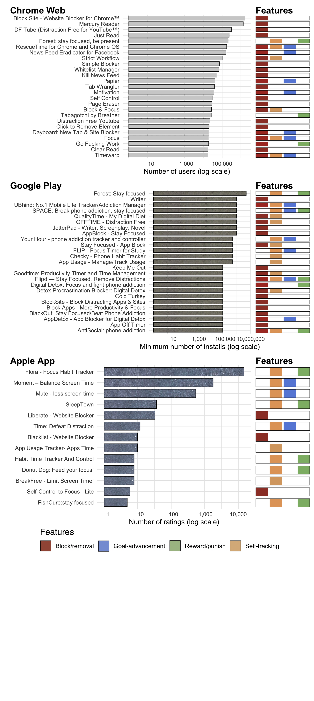

```{r setup, include=FALSE}
library(tidytext)
library(tidyverse)
library(readxl)
library(ngram)
library(scales)
library(ircor)

knitr::opts_chunk$set(echo = FALSE, message = FALSE, warning = FALSE)
options(scipen = 999)
```

# Introduction

The constant connectivity of smartphones and laptops provides innumerable benefits, but also unprecedented opportunities for distraction.
Indeed, as the business models of many tech companies have come to rely on nudging people into using digital services extensively (cf. the 'attention economy' [@davenportAttentionEconomyUnderstanding2001; @einsteinBlackOpsAdvertising2016; @wuAttentionMerchantsEpic2016]), many people routinely struggle to exercise self-control over their device use [@coxDesignFrictionsMindful2016; @koNUGUGroupbasedIntervention2015; @marottaOnlineDistractionsWebsite2017; @tranModelingEngagementDisengagementCycle2019; @hinikerMyTimeDesigningEvaluating2016].
As a result, public debate about negative effects of 'persuasive technologies' has grown [@OptimizingEngagementUnderstanding2019; @orlowski2020], alongside increased political pressure on technology platforms to safeguard users [@allpartyparliamentarygrouponsocialmediaandyoungpeoplesmentalhealthandwellbeingNewFiltersManageImpact2019].

On online stores, a flourishing market exists for 'digital self-control tools' (DSCTs), where hundreds of apps and browser extensions promise to help people take back control over their device use.
These tools offer interventions such as blocking apps or removing distracting website elements, tracking and visualising usage, or providing rewards or punishments for how devices are used [@lyngsSelfControlCyberspaceApplying2019].
Similarly, Apple and Google now offer various usage logging and self-limiting features in their 'ScreenTime' and 'Digital Wellbeing' tools, respectively [@appleIOS12Introduces2018; @gonzalezResearchGoogleNew2018; @googleDigitalWellbeing2018], and even Facebook have introduced tools 'for managing your time on Facebook and Instagram' [@ranadiveNewToolsManage2018].

In academia, a growing amount of HCI research is similarly focused on developing and evaluating various design patterns that help users self-regulate digital device use [@lottridgeBrowserDesignImpacts2012; @kimGoalKeeperExploringInteraction2019; @pinderPushAwaySmartphone2019; @tsengOvercomingDistractionsTransitions2019; @mongeroffarelloRaceDigitalWellbeing2019; @lyngsSelfControlCyberspaceApplying2019][^1].
This work has gradually built an understanding of how a range of design patterns from visualisations of time spent [@whittakerDonWasteMy2016] to goal-setting with social support [@koNUGUGroupbasedIntervention2015] can help people stay in control.
However, we are still in the early days of answering basic questions including how to define and measure 'success' for these design patterns, how implementation details of specific design patterns --- such as the level of 'friction' --- influence their usefulness, and how much people vary in how useful they find particular interventions [@kimGoalKeeperExploringInteraction2019; @markEffectsIndividualDifferences2018; @tseng2019; @lyngsTellMeWhat2018; @hinikerMovingGreatScreen2019].

[^1]: We use the term 'design patterns' to refer to specific functions intended to support people in self-regulating their digital device use (e.g., hiding newsfeeds, providing goal reminders).
    We use the term 'digital self-control tool' (DSCT) to refer to apps and browser extensions that implement a given design pattern (e.g., a browser extension for hiding Facebook's newsfeed).
    We occasionally use the term 'intervention' to refer to the implementation of a design pattern in the context of it changing a user's usual digital environment, or when it is being evaluated in a research study.

To answer such questions, most existing studies have taken an experimental approach and compared user behaviour and perceptions when applying a given intervention to its absence and/or some alternative intervention [@lyngs2021].
Yet, while controlled studies are appropriate and feasible for evaluating and comparing a small number of design patterns, they are difficult to scale to broadly assess a large numbers of patterns and implementations.

A complementary approach, which can help scope the range of design patterns and implementations to explore in controlled studies, is to investigate the existing landscape of DSCTs on app and web stores [@lyngsSelfControlCyberspaceApplying2019; @mongeroffarelloRaceDigitalWellbeing2019; @vanvelthovenProblematicSmartphoneUse2018].
Here, user reviews and popularity metrics can provide information about user needs, contexts of use, and the relative utility of different patterns and implementations 'in the wild'.
However, few studies to date have taken this approach.
Hence, in the present paper, we contribute to the HCI literature on design patterns for digital self-control by using app and web store information as a resource for understanding user self-experimentation with DSCTs.
Specifically, we present an analysis of user reviews, functionality, installation numbers, and ratings for 334 digital self-control tools, drawn from Lyngs et al. [@lyngsSelfControlCyberspaceApplying2019] who reviewed functionality in such tools on the Google Play, Chrome Web, and Apple App stores.

Our analysis of user reviews finds that digital self-control tools are seen as highly important to supports focus on less instantly rewarding goals when digital distractions are easily available, specifically in contexts related to productivity (including work, studying, reading, and writing), and going to sleep.
DSCTs appeared to be especially useful for people who describe themselves as 'addicts' or as struggling with distraction due to conditions like ADHD.

Users want DSCTs to adapt to their personal definition of 'distraction', as seen in common requests for customisation of *what* and *when* particular usage patterns should be blocked or tracked.
One important reason that users' and tools' conceptualisation of distraction should be in close alignment is that DSCTs' interventions, useful as they may be, can elicit negative emotional reactions.
This may cause the effects of interventions to be counterproductive, especially if users perceive DSCTs' goals or framing to differ from their own.

Finally, users want DSCTs to provide carefully calibrated incentives that are sufficient to incentivise intended behaviour change without feeling overly intrusive.
In our analysis, DSCTs 'Goldilocks level'[^2] varied between reviewers.
However, reviewers commonly wanted tools that provided incentives strong enough to keep themselves on track in moments of temptation or absentmindedness.
Overly strong incentives could, however, backfire if they made users feel like a failure (in the case of reward/punishment tools) or did not allow some way to handle genuine emergency use (in the case of block/removal tools).

[^2]: After the fairy tale 'Goldilocks and the Three Bears', where a young girl tastes three different bowls of porridge and prefers the one that is neither too hot nor too cold, but 'just right'.
    The concept of the 'just right amount' is often referred to as the 'Goldilocks principle'.
    For example, a widely cited paper on the relationship between screen time and mental well-being documented that a balance point in between "too much" and "too little" tech use seemed optimal, which they referred to as the 'digital Goldilocks hypothesis' [@Przybylski2017].

One way for tools to provide properly calibrated incentives might be by carefully combining different types of design patterns (e.g., using both block/removal and goal-advancement features).
This was often asked for in reviews' feature suggestions, and tentatively supported by higher overall ratings given to tools that combine two or more types compared to just one.
A final consideration related to the amount of effort involved in operating a tool, where low friction to set up and initiate use (e.g., via schedules where a tool automatically turns on), but high friction to override it, was important.

## Motivation and background

In HCI, a range of studies have developed and evaluated design patterns for digital self-control, ranging from ambient visualisations of time spent [@whittakerDonWasteMy2016] and distraction blocking [@kimGoalKeeperExploringInteraction2019] to goal-setting and social support [@koNUGUGroupbasedIntervention2015].
This research is starting to build an evidence base of how specific interventions to support self-regulation influence user behaviour and perceptions, but basic questions remain open.
These include *conceptual challenges* (e.g., what metrics digital self-control tools should seek to optimise, as simply measuring impact on 'screen time' is deemed inadequate by most researchers [@cecchinatoDesigningDigitalWellbeing2019; @hinikerMovingGreatScreen2019; @lukoffDigitalWellbeingWay2019]); related gaps in our understanding of *individual variation in user needs* (such as how how widely people differ in what they consider 'distracting' usage [@cecchinatoDesigningDigitalWellbeing2019; @lukoffDigitalWellbeingWay2019]); and *practical implementation challenges* (such as how much 'friction' tools should apply to hold users accountable for their past preferences [@kimGoalKeeperExploringInteraction2019; @coxDesignFrictionsMindful2016; @lyngsTellMeWhat2018]).

One approach to addressing these questions is to evaluate new or existing interventions in lab and field studies, and/or conduct surveys or interviews with users.
A complementary approach, which we explore in the present paper, is to investigate the landscape of digital self-control tools available online.
Here, many hundreds of tools are exploring a wide range of strategies, from limiting the amount of functionality available on home screens (e.g.\~the Android app \emph{LessPhone Launcher} [@mohanLessPhoneLauncher2019]) and hiding or modifying content on distracting websites (e.g. *Newsfeed Eradicator* [@jdevNewsFeedEradicator2019]), to gamifying self-control by tying device use to the wellbeing of virtual creatures (e.g. *Forest* [@seekrtechForestStayFocused2018]).

Some of these tools have millions of users [@lyngsSelfControlCyberspaceApplying2019], and they effectively represent a myriad of natural studies in which individuals self-experiment with tools that represent not only one or more design patterns, but specific ways to implement those patterns [@daskalovaSleepCoacher2018; @leeSelfExperimentation2017].
Indicators of the outcome of these experiments include user reviews, store ratings, and installation numbers, which may provide valuable information about the usefulness of different design patterns and implementations.

Other areas of HCI research have benefited from taking such an approach.
For example, in mental health research, thematic analysis of user reviews has been used to explore factors important for optimising user experience and support engagement in apps for cognitive behavioural therapy [@bakkerMentalHealthSmartphone2016; @huguetSystematicReviewCognitive2016; @luiEvidencebasedAppsReview2017; @sucalaAnxietyThereApp2017; @stawarzUserExperienceCognitive2018].
<!-- Similar research found that content in popular apps marketed as reducing symptoms of anxiety and worry was largely inconsistent with evidence-based treatments [@kertzReviewFreeIPhone2017]. --> <!-- This opened avenues for further research including how established CBT practices could more effectively be disseminated and, conversely, what might be learned from alternative approaches that proved popular in the wild. --> <!-- HCI research on design patterns for digital self-control might in a similar way derive actionable insights from the large number of tools for this purpose available online. --> However, few studies on digital self-control have so far taken this route: To the best of our knowledge, four published studies have described and/or categorised functionality in samples of digital self-control tools available online [@biskjaerTakingActionDistraction2016; @lyngsSelfControlCyberspaceApplying2019; @mongeroffarelloRaceDigitalWellbeing2019; @vanvelthovenProblematicSmartphoneUse2018]: Velthoven et al. [@vanvelthovenProblematicSmartphoneUse2018] presented aims and features in 21 tools identified via the software recommendation platform [alternativeto.net](https://alternativeto.net); Biskjær et al. [@biskjaerTakingActionDistraction2016] presented a taxonomy of functionality based on 10 tools from the Google Play, Chrome Web, and Apple App stores, and online tech magazines; Roffarello & Russis [@mongeroffarelloRaceDigitalWellbeing2019] presented a taxonomy of functionality based on 42 mobile apps from the Google Play store; and Lyngs et al. [@lyngsSelfControlCyberspaceApplying2019] presented a taxonomy of functionality based on 367 tools from the Google Play, Chrome Web and Apple App stores, which was mapped to psychological mechanisms in a dual systems model.

Only one of these studies analysed user reviews, namely Roffarello & Russis [@mongeroffarelloRaceDigitalWellbeing2019], which included thematic analysis of 1,128 reviews from 42 smartphone apps, and none incorporated popularity metrics.
Moreover, Roffarello & Russis' analysis was restricted to 42 smartphone apps drawn from the Google Play store and did not specify how the reviews were distributed across apps with different functionality.
Thematic analysis is likely to yield different results depending on how reviews are sampled across tools with different functionality, and depending on the analysis strategy [@chenARminerMiningInformative2014; @braunThematicAnalysis2018].
Therefore, additional analyses with broader sampling of tools, and transparent sampling of reviews from those tools, might be helpful.

On this background, we extended existing studies of publicly available digital self-control tools by (i) scraping installation numbers, ratings, and user reviews from a broad sample of tools across stores and types of functionality, (ii) analysing review content using 'reflexive' thematic analysis [@braunThematicAnalysis2018], and (iii) analysing popularity metrics' relationship to tools' design features, and (iv) making our materials, analysis pipelines and data openly available for the purpose of transparency and reusability [@harozUpdatesCHISubmission2019].

# Methods

Data, analysis scripts, and materials for the present paper are available at [osf.io/cdqub/](https://osf.io/cdqub/).

We investigated the 367 digital self-control tools reviewed by Lyngs et al. [@lyngsSelfControlCyberspaceApplying2019], as this paper provided the largest currently available review of DSCTs.
Lyngs et al. identified these tools by downloading search results for the terms 'distraction', 'addiction', 'motivation', and 'self-control', individually as well as prefixed by 'internet', 'smartphone', and 'laptop', on the Chrome Web, Google Play, and Apple App stores.
From the initial results (4890 distinct apps and extensions), they included tools explicitly designed to help people self-regulate digital device use, resulting in a data set of 367 tools (222 browser extensions from Chrome Web, 87 apps from Google Play, and 58 apps from the Apple App store).[^3]

[^3]: See Lyngs et al. [@lyngsSelfControlCyberspaceApplying2019] and their supplementary materials on [osf.io/zyj4h/](https://osf.io/zyj4h/) for further details.

We adopted Lyngs et al.'s classification of functionality within these tools, which clustered their features into four types of design patterns for digital self-control:

-   \emph{block/removal} (features for blocking distractions, such as temporarily locking the user out of specific apps, or for removing them in the first place, such as hiding recommended videos on YouTube)
-   \emph{self-tracking} (features for tracking and/or visualising device use, such as showing how much time the user has spent in particular apps or on their devices overall, or letting the user start a countdown timer when they need to focus)
-   \emph{goal-advancement} (features for reminding the user of their usage goals, such as displaying pop-ups when a specific amount of time has been spent, or replacing the content of new browser tabs with to-do lists)
-   \emph{reward/punishment} (features that add incentives for using devices in particular ways, such as rewarding the user with points/streaks when they do not use their phone, or specific apps)

## Collecting tool information and user reviews

In March 2019, we scraped additional information about these tools, including installation numbers, ratings, and store descriptions, as well as publicly available user reviews.
For apps on the Google Play store, we used a pre-existing script [@olanoGoogleplayscraper2018] to scrape tool information and reviews.
For apps on the Apple App store, we used a pre-existing script [@olanoAppstorescraper2018] to scrape reviews, and used our own script (using the R packages \href{https://rvest.tidyverse.org}{\texttt{rvest}} and \href{http://ropensci.github.io/RSelenium/}{\texttt{RSelenium}}) to scrape tool information.
As the pre-existing script sometimes failed to retrieve all reviews visible on tools' pages on the Apple App store, we wrote an additional R script to scrape reviews when manual inspection found some to be missing.
For browser extensions on the Chrome Web store, we wrote our own R script to scrape both tool information and user reviews.

## Data and analysis approach

### User numbers and ratings

All stores displayed average ratings, as well as a count of how many ratings a tool had received.
For installation numbers, the stores provided different information: the Chrome Web store provided an exact number of users, and the Google Play store provided a 'minimum number of installs' (e.g. '100,000+').
The Apple App store provided no direct information about user numbers.
For processing which ranked tools by installation numbers, we used number of ratings as a proxy for relative numbers of users for tools on the Apple App store.

\subsection{Sampling and thematic analysis of user reviews}

To get a broad coverage of reviews for tools across stores and types of design patterns, we used an R script to systematically sample user reviews for qualitative analysis from the full scraped data.
To ensure that the reviews we analysed came from tools with a minimum level of engagement from users, we excluded reviews from tools on the Google Play and Chrome Web stores that had fewer than 100 installations/users, and tools from the Apple App Store that had fewer than 5 ratings.
To make the sampled reviews more likely to be informative, we also excluded reviews shorter than 10 words.
Our script then iterated through the four types of design patterns described above, on each iteration picking the tool on each store that included that specific type of design pattern and had the highest number of users (Google Play and Chrome Web) or ratings (Apple App store).
The script then randomly sampled up to 30 user reviews from each of those tools (if a specific tool had fewer than 30 reviews, all of its reviews would be included), and started over.
The script ran until more than 1,500 reviews were sampled in total.
A tool could only be sampled from once.

Next, we conducted inductive thematic analysis of the sampled reviews, following the 'reflexive' approach described in [@braunUsingThematicAnalysis2006] and [@braunThematicAnalysis2018].
Our work was informed by an earlier analysis of 961 reviews randomly sampled from the same data set by the lead author of the present paper [@lyngs2021a, ch. 4].
However, our analysis in the present paper was conducted from scratch, with a new sample of user reviews drawn in the manner described.
First, the lead author (UL) read through all user reviews sampled for thematic analysis and conducted initial coding of recurrent patterns relevant to the research topic.
A second author (LC) read through one third of the reviews and independently coded recurrent patterns of meaning.
Afterwards, these two authors read through the coded excerpts, recoded them, iteratively sorted the codes into potential themes, and discussed emerging themes.

Thematic coding was conducted using [NVivo](https://www.qsrinternational.com/nvivo-qualitative-data-analysis-software/home/) v1.6.1; all quantitative analyses were conducted in R.

# Results

```{r, include=FALSE}
meta_data <- read_csv(here::here("data", "processed", "meta_data_all_w_design_pattern_types.csv"))
original_tools <- read_csv(here::here("materials", "2018-12-30_lyngs_tools.csv"))

reviews_w_main_cat_data <- read_csv(here::here("data", "processed", "distinct_reviews.csv")) %>% 
  mutate(review_word_count = stringi::stri_count_words(review_text))

(num_missing <- original_tools %>% 
  filter(!(tool_id %in% meta_data$tool_id)) %>% 
  nrow())

(num_w_info_by_store <- meta_data %>% count(store))

## tools w reviews
got_reviews_from <- reviews_w_main_cat_data %>% 
  distinct(tool_id)

(num_tools_w_reviews_by_store <- reviews_w_main_cat_data %>% 
  distinct(tool_id, store) %>% 
  count(store))

(num_reviews_by_store <- reviews_w_main_cat_data %>% 
  count(store))

```

At the time of scraping, `r num_missing` of the tools from Lyngs et al.'s review had become unavailable.
Hence, we scraped information for `r nrow(meta_data)` tools: `r num_w_info_by_store %>% filter(store == "chrome") %>% pull(n)` extensions from Chrome Web, `r num_w_info_by_store %>% filter(store == "play") %>% pull(n)` apps from Google Play, and `r num_w_info_by_store %>% filter(store == "apple") %>% pull(n)` apps from the Apple App store.

`r nrow(got_reviews_from)` of these tools had received user reviews (`r num_tools_w_reviews_by_store %>% filter(store == "chrome") %>% pull(n)` from Chrome Web, `r num_tools_w_reviews_by_store %>% filter(store == "google_play") %>% pull(n)` from Google Play, and `r num_tools_w_reviews_by_store %>% filter(store == "apple") %>% pull(n)` from the Apple App store).
From these, we collected a total of `r format(nrow(reviews_w_main_cat_data), big.mark = ",")` reviews (`r num_reviews_by_store %>% filter(store == "chrome") %>% pull(n) %>% format(big.mark = ",")` from Chrome Web, `r num_reviews_by_store %>% filter(store == "google_play") %>% pull(n) %>% format(big.mark = ",")` from Google Play, and `r num_reviews_by_store %>% filter(store == "apple") %>% pull(n) %>% format(big.mark = ",")` from the Apple App store).

## User reviews

(ref:word-cloud-caption) Word cloud depicting frequencies of terms across all `r format(nrow(reviews_w_main_cat_data), big.mark = ",")` reviews. Font size indicates relative frequency. The word cloud excludes the terms 'app/s', 'phone', and 'extension', as well as stop words (i.e., common English words unlikely to be informative such as "the", "of", "to", etc. Stop words were excluded using the R package `tidytext` [@silge2016tidytext]). Colouring is aesthetic and does not map to any characteristics of the data.

```{r wordcloud, fig.cap="(ref:word-cloud-caption)", out.width='100%'}
knitr::include_graphics("figures/wordcloud.png")
```

```{r, include=FALSE}
(num_reviews_summary <- reviews_w_main_cat_data %>% 
  group_by(tool_id) %>% 
  summarise(num_reviews = n()) %>% 
  summarise(mean = mean(num_reviews),
            min = quantile(num_reviews, 0),
            q_25 = quantile(num_reviews, 0.25),
            median = quantile(num_reviews, 0.5),
            q_75 = quantile(num_reviews, 0.75),
            max = quantile(num_reviews, 1))

(word_count_summary <- reviews_w_main_cat_data %>% 
  summarise(mean = mean(review_word_count),
            min = quantile(review_word_count, 0),
            q_25 = quantile(review_word_count, 0.25),
            median = quantile(review_word_count, 0.5),
            q_75 = quantile(review_word_count, 0.75),
            max = quantile(review_word_count, 1)))

(ptc_app <- reviews_w_main_cat_data %>% 
  mutate(has_app = str_detect(review_text, "app")) %>% 
  count(has_app) %>% 
  mutate(ptc = (n/sum(n))*100) %>% 
  filter(has_app == TRUE) %>% 
  pull(ptc) %>% 
  round())

(ptc_time <- reviews_w_main_cat_data %>% 
  mutate(has_time = str_detect(review_text, "time")) %>% 
  count(has_time) %>% 
  mutate(ptc = (n/sum(n))*100) %>% 
  filter(has_time == TRUE) %>% 
  pull(ptc) %>% 
  round())
```

For the tools that had received reviews, the median number of reviews was `r num_reviews_summary$median` (min = `r num_reviews_summary$min`, max = `r num_reviews_summary$max`, IQR = `r num_reviews_summary$IQR`), and the median number of words was `r word_count_summary$median` (min = `r word_count_summary$min`, max = `r word_count_summary$max`, IQR = `r word_count_summary$IQR`; reviews containing only emojis have a word count of 0).
Figure \@ref(fig:wordcloud) shows the overall frequency of terms used in the reviews, excluding 'app/s', 'phone' and 'extension' as well as common stop words in English (e.g., 'the', 'of', 'to'; stop words were excluded using the R package `tidytext` [@silge2016tidytext]).
Aside from 'app' (46% of reviews), the most frequent term was 'time', which was included in 17% of all reviews.
The terms most commonly following or preceding 'time' included 'limit', 'usage', 'spent', 'screen', 'waste', and 'management', suggesting that managing time spent on digital devices was a central topic in the reviews.

```{r review-bigrams, eval=FALSE}
review_bigrams <- reviews_w_main_cat_data %>% 
  unnest_tokens(bigram, review_text, token = "ngrams", n = 2)

bigrams_separated <- review_bigrams %>%
  separate(bigram, c("word1", "word2"), sep = " ")

bigrams_filtered <- bigrams_separated %>%
  filter(!word1 %in% stop_words$word) %>%
  filter(!word2 %in% stop_words$word)

bigram_counts <- bigrams_filtered %>% 
  count(word1, word2, sort = TRUE)

```

### Thematic analysis

(ref:ta-reviews-by-design-patterns) Reviews sampled for thematic analysis (total n = 1,529), by design patterns included in the tools.

```{r sampled-reviews}
reviews_for_ta <- read_excel(here::here("data", "processed", "2022-01-22-reviews_for_ta.xlsx"))

num_tools_within_categories <- reviews_for_ta %>% 
  distinct(categories_alphabetically, tool_id) %>% 
  group_by(categories_alphabetically) %>% 
  summarise(num_tools = n())

num_reviews_within_categories <- reviews_for_ta %>% 
  group_by(categories_alphabetically) %>% 
  summarise(num_reviews = n())

# create a table with the count of tools and review from each combination of functionality
num_tools_within_categories %>% 
  left_join(num_reviews_within_categories) %>% 
  mutate(num_categories = str_split(categories_alphabetically, "\\+")) %>% 
  rowwise() %>% mutate(num_categories = length(num_categories)) %>% ungroup() %>% 
  arrange(num_categories, categories_alphabetically) %>% 
  mutate(`Colour code` = categories_alphabetically %>% str_replace("Block/removal", "\\\\typeBlock") %>% str_replace("Reward/punish", "\\\\typeReward") %>% str_replace("Self-tracking", "\\\\typeTrack") %>% str_replace("Goal-advancement", "\\\\typeGoal") %>% str_remove_all(" \\+ ")) %>% 
  select("Design patterns included" = categories_alphabetically,
         "Colour code",
         "Number of tools" = num_tools,
         "Number of reviews" = num_reviews) %>% 
  knitr::kable(caption = "(ref:ta-reviews-by-design-patterns)", escape = FALSE) %>% 
  kableExtra::landscape()

```

We conducted thematic analysis of `r nrow(reviews_for_ta)` reviews from a total of `r reviews_for_ta %>% distinct(tool_id) %>% nrow()` different apps (Table \@ref(tab:sampled-reviews) shows how the reviews were distributed across tools with different combinations of design patterns).
In the following analysis, we accompany review quotes with the name of the tool the review was for, a colour coded indication of which design patterns the tool included, and which store it came from:

-   \typeBlock\hspace{1mm}= block/removal, \typeTrack\hspace{1mm}= self-tracking,\
    \typeGoal\hspace{1mm}= goal-advancement, \typeReward\hspace{1mm}= reward/punish
-   C = Chrome Web, P = Google Play, A = Apple App store
    -   Example review quote from a Chrome Web tool including design patterns for block/removal, self-tracking, and goal-advancement: *"It would be nice to make it hard to disable, something like a simple maths problem that we could change difficulty, so I am not tempted."*, R1408, Timewarp \typeBlock\typeTrack\typeGoal \\textbf{C}

Our early codes were 'domain summaries' [@braunThematicAnalysis2018] organised in an evolving hierarchy of sub-codes.
For the first coder (UL), early codes were organised in relation to usage contexts and benefits, user characteristics, key design patterns, and praise or criticism of the developer or app.
For the second coder (LC), early codes were organised in relation to feature requests, positive feedback, negative feedback, and reasons for use.

An early observation as we explored reported benefits of use was that a substantial proportion of reviews expressed highly positive and important impact of the tools used (n = 480, 22% of reviews).
Thus, the reviews described a common feeling of lacking control over digital device use, which resulted in using devices in unintended ways, or in using them so much that it interfered with other goals.
However, digital self-control tools were seen as effectively helping reviewers take back control, save time, and improve their lives (*"I can happily say that this extension has changed my life!!!! It hides EVERY ANNOYING YouTube feature"*, R385, \href{https://chrome.google.com/webstore/detail/df-tube-distraction-free/mjdepdfccjgcndkmemponafgioodelna?hl=en}{DF Tube} \typeBlock \\textbf{C}, *"Has saved me countless hours of time-wasting nonsense"*, R1000, NewsFeed Eradicator for Facebook \typeBlock\typeGoal \\textbf{C}), and many expressed deep appreciation towards the developers ("Who so ever is working behind this software, my deepest gratitude to them", R271, \href{https://chrome.google.com/webstore/detail/blocksite-block-websites/eiimnmioipafcokbfikbljfdeojpcgbh?hl=en-GB}{\emph{BlockSite}} \typeBlock \\textbf{C}).
Some reviewers seemed surprised that particular tools had been useful to them (*"I added it more as a joke, but it's really good and helpful for those hours you're supposed to study and don't want to be distracted"*, R675, \href{https://chrome.google.com/webstore/detail/go-fucking-work/hibmkkpfegfiinilnlabbfnjcopdiiig}{Go Fucking Work} \typeBlock\typeReward \\textbf{C}).
Importantly, the reviews also contained a wealth of information on how specific implementations of design patterns could fail to fulfil their purpose, and how they might be improved.

```{r, include=FALSE}
theme_one <- "DSCTs as essential for focusing on less instantly rewarding tasks when digital distractions are easily available"
theme_two <- "DSCTs should flexibly adapt to personal definitions of 'distraction'"
theme_three <- "DSCTs should provide incentives that are sufficient to change behaviour without feeling overly intrusive"
```

As we iteratively worked with the codes and excerpts, we developed three broad themes capturing digital self-control tools' (DSCTs) use contexts and design challenges, assembled from recurrent patterns in the early codes: (i) `r theme_one`, (ii) `r theme_two`, (iii) `r theme_three`

The NVivo files with our early codes, and their later re-organisation by relation to the three main themes, as well as exports of the code hierarchy to other formats, are available on \href{https://osf.io/cdqub/}{osf.io/cdqub/}.

#### **Theme 1: `r theme_one`**

Users saw DSCTs as critical to avoiding time-wasting patterns of habitual or impulsive digital device use.
Many reviews described this challenge as related to 'addictive' design patterns and other adversarial dynamics online, to which DSCTs provided essential countermeasures that reviewers had searched for (*"Was looking for a solution for this for over 1 year"*, R771, \href{https://chrome.google.com/webstore/detail/inbox-when-ready-for-gmai/cdedhgmbfjhobfnphaoihdfmnjidcpim}{Inbox When Ready for Gmail} \typeBlock\typeGoal\typeTrack \\textbf{C}; *"Should be on all phones as standard"*, R982, Mute Screen Time Tracker \typeGoal\typeTrack \\textbf{A}).
DSCTs seemed especially helpful when it was not possible to avoid using distracting services (*"This helps me avoid the mind numbing news feed that is of Facebook when work has to be done on Facebook itself"*, R873, \href{https://chrome.google.com/webstore/detail/kill-news-feed/hjobfcedfgohjkaieocljfcppjbkglfd}{Kill News Feed} \typeBlock \\textbf{C}).

The usage contexts mentioned suggested that, aside from wanting to limit time on devices overall or on specific services (n = 62, 4% of reviews), reviewers used DSTCs to help them focus on a given task amidst all too easily available distractions on their devices (n = 201, 13%).
The need for support from DSCTs to stay focused seemed especially acute when tasks were important, but less instantly rewarding, expressed in some reviews as DSCTs helping overcome 'procrastination' (*"seeing my short-term to-do list nudges me to get back to work when I am opening a new website to procrastinate"*, R324, Dayboard \typeBlock\typeTrack \\textbf{C}).
In these situations, DSCTs helped reviewers stay in control by reminding them of what they wanted to do by reducing exposure to 'temptations' (*"Without it, it is too easy for me to be tempted to view and open YouTube sidebar links"*, R376, DF Tube \typeBlock \\textbf{C}), and/or by providing incentives for intended use (*"Not only does it help me stay focused, I smile with delight looking at all my trees and flowers at the end of the day"*, R642, Forest \typeTrack\typeReward \\textbf{C}).
Thus, many reviewers generically stated that DSCTs benefited them in productivity/work contexts (n = 167, 11%; "Not being distracted by unread/misc emails has proven to be of significant benefit to my productivity", R776, \href{https://chrome.google.com/webstore/detail/inbox-when-ready-for-gmai/cdedhgmbfjhobfnphaoihdfmnjidcpim}{\emph{Inbox When Ready for Gmail}} \typeBlock\typeGoal\typeTrack \\textbf{C}), including studying, writing, or reading (n = 90, 6%).

Another important use context was \emph{sleep}, where many reviewers said their digital devices often interfered with going to bed at the intended time.
However, DSCTs helped them adjust their habits in favour of the sleep patterns they wanted (*"I always used to stay up really late on my phone until I got this app - I have consistently been getting 9 hours sleep and waking up early for the first time in my life !!"*, R1252, [SleepTown](https://apps.apple.com/gb/app/sleeptown/id1210251567)\typeTrack\typeReward \\textbf{P}; *"It really forces me to stay off to the phone, and so it's useful especially when I need to go to bed"*, R198, BlackOut \typeBlock \\textbf{P}).

**Sub-theme: DSCTs as especially useful for people with more acute self-regulation challenges** In an extension of the main theme, DSCTs seemed especially useful for individuals who experience self-regulation challenges more intensely.
This was often expressed as a tool being helpful for tackling 'addiction', and/or as reviewers labelling themselves 'addicts', 'procrastinators' or just low in self-control (n = 58, 3.8%; *"This was the perfect solution to my phone addiction. It was consuming my life and my free time"*, R612, Forest \typeTrack\typeReward \\textbf{P}).
Sometimes reviewers used the clinical labels ADD or ADHD to explain why tools had been helpful to them (*"As someone with ADHD, the pomodoro technique has been super effective"*, R615, Forest \typeTrack\typeReward \\textbf{P}).

#### **Theme 2: `r theme_two`**

DSCTs needed to accurately capture users' personal definitions of 'distracting use' to be helpful (n = 237, 16%), a theme often expressed in the form of feature suggestions that would make tools more customisable.

One aspect involved getting tools to accurately capture \emph{what} was considered a distraction.
Thus, for block/removal tools, reviewers wanted to be able to customise which apps or websites were targeted, or target blocking to specific functionality (\emph{"I would like to block reddit but still be able to visit productivity related subreddits"}, R1401, Timewarp \typeBlock\typeTrack\typeGoal \\textbf{C}).
Similarly, self-tracking tools often received feature requests for the ability to exempt specific functionality from tracking because not all use represented use that reviewers wanted support in managing (*"I use a meditation app and can be meditating several times a day, sometimes up to an hour at a time, so as it doesn't distinguish between that and social media it gives a false impression of"usage""*, R989, Mute Screen Time Tracker \typeGoal\typeTrack \\textbf{A}).

Another aspect involved \emph{when} specific activities should count as distractions.
For example, tools for curbing nightly use received feature requests to handle variation in bedtime schedules (*"it needs to allow for the real life fact that people can't go to bed and wake up at the same time everyday. If it was done on your amount of sleep you get in hours that would be better"*, R1250, [SleepTown](https://apps.apple.com/gb/app/sleeptown/id1210251567)\typeTrack\typeReward \\textbf{A}).

**Sub-theme: Alignment between users' and tools' framing of distraction as important for navigating negative emotions elicited by DSCTs** Aside from practical reasons that DSCTs should accurately capture behaviour that reviewers wished to change, an important factor was the negative emotions that interventions could elicit.
Thus, whereas the various restrictions and reminders provided by DSCTs were seen as helpful and essential, users also needed to carefully navigate the emotional reactions they could create (*"I hate it and love it at the same time.* \emojiTearsOfJoy", R1299, Stay Focused \typeBlock\typeTrack \\textbf{P}, *"Pisses me off sometimes, but worth it"*, R357, Detox Procrastination Blocker, \typeBlock\typeTrack \\textbf{P}).
In order for experiences of "shock", "pressure", etc., to be useful, it was important that the user felt that a DSCT's purpose and framing of usage were closely aligned with their personal perspective.

Thus, tools that provided standards for 'good' or 'bad' usage, for example in their presentation of usage statistics or reminder pop-ups, needed to tread carefully.
Being reminded that one did not behave in line with one's intentions could be very helpful (*"This tells it like I need to be told sometimes...LOVE IT! Simple and effective :)"*, R690, \href{https://chrome.google.com/webstore/detail/go-fucking-work/hibmkkpfegfiinilnlabbfnjcopdiiig}{Go Fucking Work} \typeBlock\typeReward \\textbf{C}; *"I like the guilt trip it gives me if I attempt to get into facebook or other social networks"*, R311, Dayboard, \typeBlock\typeGoal \\textbf{C}). However, normative messaging could also backfire and be profoundly annoying if reviewers did not agree with it (*"I was a bit annoyed when Big Brother started getting judgemental on me. "You have hit your target of 50 pickups!" "You've now picked up your phone 90 times!" Well, first I didn't set a target, and second, I don't think that 54 minutes across a day should make me feel guilty. Especially since I was reading a book during that time"* R911, Moment \typeGoal\typeTrack \\textbf{A}).

#### **Theme 3: `r theme_three`**

Reviewers searched for DSCTs that provided interventions whose incentives were 'just right' to bring about an intended change in behaviour without feeling overly intrusive.
The reviews implied a spectrum of individual differences in where this 'Goldilocks level' was.
A few reviewers stated that simply receiving reminders or knowing that a tracking tool was monitoring them was sufficient (*"I know it's tracking me so I pick up the phone a lot less"*, R992, \emph{Mute Screen Time Tracker} \typeGoal\typeTrack \\textbf{A}).
More commonly, however, reviewers wanted DSCTs to provide more strict or persuasive ways to hold themselves accountable, so that they did not succumb to temptations or unwanted habits in moments of weakness or absentmindedness (n = 132, 9%).

Thus, tools implementing block/removal design patterns were often criticised if they were too easy to disable (*"This is fantastic but the thing is I can simply remove the extension from chrome which defeats the purpose. Does anyone know how I can stop myself from removing the extension?"*, R1217, Simple Blocker \typeBlock \\textbf{C}).
However, if they were *too* difficult to override, they ran into another problem, namely how to deal with emergencies or otherwise unforeseen circumstances.
One developer followed reviewers' suggestion to add a 'pause' button, only to receive critique that blocking was now too easy to override.
Reviewers suggested that adding varying forms of friction to turn off blocking would be a solution, such as having to complete a time-consuming or effortful task (*"make it necessary to touch the screen for a minute or 2 so that it becomes harder for anyone to stop it"*, R8, ( OffTime ) \typeBlock\typeTrack \\textbf{P}), or simply adding passwords, which could be set by a trusted other.

Similarly, for tools implementing reward/punishment, some reviewers suggested increasing incentives to make tools more effective (*"If I could also name the trees (so I'll feel even worse about letting them die) it would be even better!"*, R650, Forest \typeTrack\typeReward \\textbf{C}). Here too, however, tools needed to find the right balance, because punishments that were perceived as too harsh might make users feel like failures (*"I hate the fact that we get a destroyed building (...) I feel like it is too punishing and almost says 'you've failed'"*, R1247, \href{https://itunes.apple.com/gb/app/sleeptown/id1210251567?mt=8\&uo=4}{SleepTown} \typeTrack\typeReward \\textbf{P}).

For tools including goal advancement design patterns, the 'right' level of incentive often related to the frequency or framing of features such as reminder pop-ups, which needed to be finely calibrated to be helpful rather than annoying (*"the todo popup on each page load is quite useful (...) it should be limited (across multiple tabs) to only pop-up every minute or so (...) I find myself snoozing it too often just because the popup bothers me"*, R339, Dayboard, \typeBlock\typeGoal \\textbf{C}).

**Sub-theme 1: Combining types of design patterns to find the Goldilocks level of incentive** In addition to tweaking parameters of a tool's current design patterns, many reviewers suggested including other types of patterns to make tools more effective.
Thus, some reviewers for self-tracking tools said that simply being informed about their behaviour was not sufficient for them to change anything.
However, incorporating other types of elements might make it more effective, such as combing self-tracking with goal-setting.

Similarly, some reviewers wanted block/removal tools to not simply block distractions, but also actively nudge their behaviour in ways that supported intended habits.
This might happen by, for example, forwarding blocked websites to productive alternatives, or by replacing algorithmic recommendations with content that they wanted to engage with more ("\emph{if, where the home-screen recommended section is, this could be replaced by a website of our choice} (\ldots) \emph{This way I could do music theory, or learn German. Things I always intend to do, but don't do enough. But if these things came up every time I log into Youtube I'd definitely use them."}, R372, \href{https://chrome.google.com/webstore/detail/df-tube-distraction-free/mjdepdfccjgcndkmemponafgioodelna?hl=en}{DF Tube} \typeBlock \\textbf{C}).

**Sub-theme 2: DSCTs should have low friction to start and use, but high friction to stop** Finally, finding the right level of friction also related to the level of effort required to use a tool.
The amount of effort needed to \emph{initiate} use was important to keep low, because a lack of motivation could easily lead users to not use an otherwise effective tool (*"Most users have procrastination issues which make them postpone the moment in which they will click on the "Start focusing" button. Therefore those users (including me) will get distracted and they will click on that button after several hours, or even never, sometimes wasting a whole working day"*, R545, Focus \typeBlock\typeGoal\typeTrack \\textbf{C}). Therefore, a common feature request for blocking tools was the ability to set a schedule where blocking would automatically turn on. An interesting suggestion related to blocking tools alternating between work and break cycles: these could flip the ordering of cycles so as to begin with a break, followed by enforced blocking, which might lower the amount of motivation needed to initiate a focus session (*"Hitting the start button the very first time is hard! Starting in a short break would allow me to hit this without a second thought, because I have a few short moments to surf before the focus is forced."*, R232, Block & Focus \typeBlock\typeTrack \\textbf{C}).

The amount of effort involved in routine use of a tool was also important to keep low, because tools that were confusing or demanding were likely to be abandoned.
This seemed to present an especially difficult challenge for self-tracking tools on iOS, because Apple's restrictive developer permissions do not allow apps to easily track time spent in other apps.
As a work-around, some self-tracking tools for iOS required users to take screenshots of their phone's battery page, from which the tool was able to extract information about time spent in different apps.
However, this work-around was simply seen as too effort-demanding by many reviewers (\emph{"I should have looked at how you use this. Take a picture everyday????? Really?"}, R121, App Usage Tracker \typeTrack \\textbf{A}).

Thus, whereas high friction related to \emph{turning off} a tool could be actively helpful when it served the purpose of holding the user accountable to their own intentions, tools were criticised if they required too much effort to operate.

## User numbers and ratings

```{r tool-num-users-and-ratings-plot, fig.cap="Distributions of installation numbers and number of ratings on the Google Play, Chrome Web, and Apple App stores (tools with zero ratings scored as 0.5 ratings, to show them in this plot with a log scale). The Apple App store provided no direct information about installation numbers.", out.width='100%'}
to_visualise <- meta_data %>% 
  mutate(installs = case_when(
    store == "play" ~ min_installs,
    store == "chrome" ~ num_users,
    store == "apple" ~ NA_real_
  )) %>% 
  select(tool_id, store, installs, num_ratings) %>% 
  pivot_longer(-c(tool_id, store)) %>% 
  mutate(name = case_when(
    name == "installs" ~ "Min. installs (Google Play) / Users (Chrome Web)",
    name == "num_ratings" ~ "Number of ratings")) %>% 
  mutate(store = factor(store, levels = c("play", "chrome", "apple")),
         name = factor(name))

to_visualise %>% 
  mutate(value = if_else(value == 0, 0.5, value)) %>% # the log transformation removes tools with 0 ratings
  ggplot() +
    aes(x = store, y = value) +
    geom_boxplot(outlier.shape = NA, aes(fill = store), position = position_dodge2(preserve = "single"), alpha = 0.3) +
    scale_y_log10(labels = label_number(big.mark = ",")) +
    geom_jitter(aes(color = store), width = 0.2, height = 0, alpha = 0.5) +
    labs(x = "", y = "") +
    facet_wrap(~name) +
    guides(fill=FALSE, color = FALSE) +
    theme_minimal()

#ggsave("tool-num-users-and-ratings-plot.pdf", width = 7, height = 5)
```

```{r, users-and-category, fig.cap="Top tools in terms of installation numbers (Chrome Web and Play) or number of ratings (Apple App store). Only 13 of the Apple App store tools had received any ratings. Differences between the stores in terms of design patterns are readily apparent: Block/removal patterns are especially common on the Chrome Web store (87% of all tools), where browser extensions can easily modify distracting elements on web pages. Reward/punishment patterns are included in 43% of tools on the Apple App store, compared to, respectively, 6 and 15% on the Chrome Web and Play stores.", out.width="70%"}

```

```{r user_stats, include=FALSE}
(play_user_stats <- meta_data %>% 
  filter(store == "play") %>% 
  summarise(median_min_installs = median(min_installs),
            min_min_installs = min(min_installs),
            max_min_installs = max(min_installs),
            IQR = IQR(min_installs)))
  
(chrome_user_stats <- meta_data %>% 
  filter(store == "chrome") %>% 
  summarise(median_installs = median(num_users),
            min_installs = min(num_users),
            max_installs = max(num_users),
            IQR = IQR(num_users)))

(ratings_overall <- meta_data %>% 
  filter(num_ratings >= 1) %>% 
  summarise(median_rating = median(average_rating, na.rm = TRUE),
            min_rating = min(average_rating, na.rm = TRUE),
            max_rating = max(average_rating, na.rm = TRUE),
            IQR = IQR(average_rating, na.rm = TRUE)))

```

The distribution of numbers of users/installations and ratings are shown in Figure \ref{fig:tool-num-users-and-ratings-plot}.
For Google Play tools, the median 'minimum number of installs' was `r format(play_user_stats$median_min_installs, big.mark = ",")` (min = `r format(play_user_stats$min_min_installs, big.mark = ",")`, max = `r format(play_user_stats$max_min_installs, big.mark = ",")`, IQR = `r format(play_user_stats$IQR, big.mark=",")`).
For Chrome Web tools, the median number of users was `r format(chrome_user_stats$median_min_installs, big.mark=",")` (min = `r format(chrome_user_stats$min_min_installs, big.mark=",")`, max = `r format(chrome_user_stats$max_min_installs, big.mark=",")`, IQR = `r format(chrome_user_stats$IQR, big.mark=",")`).
(The Apple App store did not display information about number of users.) In terms of the ratings given to tools, the median average rating was `r ratings_overall$median_rating` (min = `r ratings_overall$min_rating`, max = `r ratings_overall$max_rating`, IQR = `r round(ratings_overall$IQR, 1)`; ratings given on a scale from 1 to 5 stars on all stores).

Figure \ref{fig:users-and-category} shows the top tools, ranked by number of users (Chrome Web and Play) or number of ratings (Apple App store), alongside the design patterns they include.
The distributions of design patterns included in top tools differed by store, mirroring differences between the stores overall: for example, block/removal functionality was rare on the Apple App store compared to the Google Play and Chrome Web store [@lyngsSelfControlCyberspaceApplying2019].

```{r, include=FALSE}
chrome_and_play_rankings <- meta_data %>% 
  filter(num_ratings >= 30) %>% 
  group_by(store) %>% 
  mutate(installs = case_when(
    store == "chrome" ~ num_users,
    store == "play" ~ min_installs
  )) %>% 
  select(store, tool_id, average_rating, installs) %>% 
  mutate(rank_rating = rank(desc(average_rating)),
         rank_installs = rank(desc(installs)))

cor.test(chrome_and_play_rankings %>% filter(store == "chrome") %>% pull(rank_rating),
      chrome_and_play_rankings %>% filter(store == "chrome") %>% pull(rank_installs), 
      method = "kendall")

cor.test(chrome_and_play_rankings %>% filter(store == "play") %>% pull(rank_rating),
      chrome_and_play_rankings %>% filter(store == "play") %>% pull(rank_installs), 
      method = "spearman")

meta_data %>% 
  mutate( has_blocking = str_detect(categories_alphabetically, "Block/removal")) %>% 
  group_by(store, has_blocking) %>% 
  summarise(number = n()) %>% 
  mutate(prop = number / sum(number)) %>% 
  filter(has_blocking == TRUE)


meta_data %>% 
  mutate( has_goal = str_detect(categories_alphabetically, "Goal-advancement")) %>% 
  group_by(store, has_goal) %>% 
  summarise(number = n()) %>% 
  mutate(prop = number / sum(number)) %>% 
  filter(has_goal == TRUE)

meta_data %>% 
  mutate( has_track = str_detect(categories_alphabetically, "Self-tracking")) %>% 
  group_by(store, has_track) %>% 
  summarise(number = n()) %>% 
  mutate(prop = number / sum(number)) %>% 
  filter(has_track == TRUE)

meta_data %>% 
  mutate( has_reward = str_detect(categories_alphabetically, "Reward/punish")) %>% 
  group_by(store, has_reward) %>% 
  summarise(number = n()) %>% 
  mutate(prop = number / sum(number)) %>% 
  filter(has_reward == TRUE)
```

```{r number-of-design-patterns, include=FALSE}
meta_data %>% 
  count(num_categories) %>% 
  mutate(prop = n/sum(n))

data_test_one_vs_two <- meta_data %>% 
    filter(num_ratings >= 15) %>% 
    mutate(num_categories = as.numeric(num_categories),
           num_categories_one_or_more = ifelse(num_categories == 1, "1", "2-4"))

wilcox.test(average_rating ~ num_categories_one_or_more, data = data_test_one_vs_two)

(median_one <- data_test_one_vs_two %>% filter(num_categories_one_or_more == "1") %>% pull(average_rating) %>% median(na.rm = TRUE))
(median_two_to_four <- data_test_one_vs_two %>% filter(num_categories_one_or_more == "2-4") %>% pull(average_rating) %>% median(na.rm = TRUE))

```

Across all tools, 64% included a single type of design pattern for digital self-control, whereas 32% combined two - very few combined three (3%) or all four (1%).
Tools that combined two or more types had significantly higher average ratings than tools which implemented a single type (median average rating with a single type = 4.2, median for tools combining two or more = 4.39, *p* = 0.003 in Wilcoxon's rank-sum test; analysis excludes tools with fewer than 15 ratings; see Figure \ref{fig:average-ratings-by-functionality}).

On the Chrome Web and Play stores, Block/removal was the most common type of design pattern (included in 87% and 65% of all tools, respectively, compared to 37% on the Apple App store), whereas Reward/punishment was the least common (included in 6% and 15% of tools, respectively, compared to 43% on the Apple App store).
Notably, the app 'Forest' (which combines reward/punishment and self-tracking in the form of virtual trees that grow while a timer counts down) ranked highest on the Play store and 5th on the Chrome Web store, while a very similar app, 'Flora', ranked highest on the Apple App store in terms of number of ratings received.

(ref:caption-ratings-by-functionality) Average ratings by design patterns in digital self-control tools (for tools with 15 or more ratings). Tools including more than one type of design pattern had higher average ratings (median = 4.39) than tools implementing a single type (median = 4.2, *p* = 0.003, Wilcoxon's rank-sum test).

```{r, average-ratings-by-functionality, fig.cap="(ref:caption-ratings-by-functionality)", out.width="100%"}
knitr::include_graphics("figures/ratings_by_type_annotated.pdf")
```

# Discussion

To sum up, the user reviews described DSCTs as crucial support for focusing on less instantly rewarding tasks amidst easily available digital distractions.
Specific usage contexts related mainly to productivity/work (including studying, reading, and writing), as well as sleeping.
Individuals with greater self-regulation difficulties seemed to find DSCTs particularly useful, as evidenced by reviewers who explained usefulness in terms of coping with 'addiction' or conditions like ADHD.

Reviewers wanted DSCTs to provide interventions that accurately targeted usage they wanted to better control, often expressed as feature requests for, for example, being able to target blocking to specific functionality on a website, or exempt specific apps from usage tracking.
Close alignment between user and tool in their definitions of 'distracting use' was important, partly to reduce negative emotional reactions to specific interventions, which might otherwise be considered too annoying.

Reviewers also wanted DSCTs to provide a level of incentive that was sufficient for affecting intended behaviour change without feeling too intrusive.
Reviewers differed in the level of incentive they wanted, but were commonly looking for interventions strict or rewarding enough to stay on track when they felt tempted to indulge in digital distractions or drift into unwanted habitual use.
DSCTs needed to find a delicate balance, as overly strong incentives might backfire if they made users feel dejected when they failed to live up to their intentions, or if users had no ways to handle emergency use or shifting daily schedules.

Some reviewers suggested that different types of design patterns should be combined to provide the right level of incentive.
This matched our observation in the popularity metrics that DSCTs which combined two or more types of design patterns received higher overall ratings than tools including only one.
A final consideration related to how much effort a tool required to use: Whereas a high level of friction to *stop* a tool could help hold users accountable to their goals, the level of friction required to *start* use should be low, to handle initial lack of motivation on the part of the user.

In the following, we discuss implications for future research.

\subsection{Using self-regulation measures to evaluate DSCTs and assess individual user needs}

Our work provides additional data points for the discussion around how to evaluate effectiveness of DSCTs, and understand how needs for support vary between users.
In terms of behavioural measures, our thematic analysis and the term frequencies in user reviews overall suggested that limiting time spent on devices, or in specific apps and services, was an important concern for many.
Hence, whereas simple measurements of 'screen time' may have many inadequacies in assessing DSCT effectiveness [@cecchinatoDesigningDigitalWellbeing2019; @hinikerMovingGreatScreen2019; @lukoffDigitalWellbeingWay2019], they remain important.

More commonly than limiting time, however (observed three times as frequently in our thematic analysis), the reason for using DSCTs was specifically to support focus on less instantly rewarding tasks in the face of easily available digital distractions.
This matches findings from research using other methods [@reineckeSlackingWindingExperience2016], such as Tran et al. [@tranModelingEngagementDisengagementCycle2019]'s interview study showing that tedious or effortful activities are common triggers of compulsive smartphone use, and Kim et al.'s finding that their phone-restriction app was found particularly useful in "boring classes" [@kimLetFOCUSMitigating2017].
What are the most useful ways for us to assess DSCTs' effectiveness for this purpose?

In a given context, simple behavioural measures may provide useful proxies, such as error rates or output in a work task [@borghoutsLookingInformationEmail2018; @marottaOnlineDistractionsWebsite2017] or time spent in functionality 'relevant' or 'distracting' relative to a goal [@lottridgeBrowserDesignImpacts2012; @hinikerMyTimeDesigningEvaluating2016; @whittakerDonWasteMy2016; @kimTechnologySupportedBehavior2017].
However, we also need effective ways to assess users' own experience.

Some existing work, especially on 'problematic use', has used self-report scales related to behavioural addiction to evaluate DSCTs and/or assess baseline difficulties with managing device use [@leeSAMSSmartphoneAddiction2014; @koLockLoLGroupbased2016].
Many researchers have pushed back against this approach, because it risks pathologising everyday patterns of use.
Thus, it has been argued that even frequent, extensive use that distracts users from daily life should not be considered "addiction" unless it also leads to functional impairment and psychological distress [@billieuxDysfunctionalUseMobile2015; @kardefelt-wintherHowCanWe2017; @tranModelingEngagementDisengagementCycle2019].
Moreover, references to 'addiction' among ordinary users often reflect a loose use of the term common in media and society [@tikuWIREDGuideInternet2018; @lanetteSmartphoneAddictionNarrative2018; @orbenTeensScreensWellBeing2019].
In the user review data, we did observe a number of mentions of 'addiction' (n = 52, 3%), but overall the data seemed to reflect a situation in which most users' challenges with focusing and avoiding wasted time reflected more mundane struggles and annoyances than what would deserve the clinical term 'addiction'.

A range of alternatives to addiction measures for assessing users' experience with DSCTs have been explored, including measurements of self-reported stress (e.g., the Perceived Stress scale, \cite{collinsBarriersEngagementPersonal2014}, from \cite{Cohen1983}), workload (e.g., NASA-TLX, \cite{kimLocknTypeLockoutTask2019}, from \cite{Hart1988}), and absorption in a task (e.g., Cognitive Absorption scale, \cite{markEffectsIndividualDifferences2018} from \cite{agarwalTimeFliesWhen2000}).
We suggest, however, that the most directly relevant literature to draw on is existing psychological work on self-regulation and self-control.
Here, a substantial body of research has investigated how individual differences and environmental influences affect the ability to regulate behaviour towards desired goals in the face of conflicting impulses and distractions.
HCI research on DSCTs can be viewed as a sub-field in this respect, which investigates self-regulation in relation to digital devices such as smartphones and laptops, and how to support it by design.

Thus, early research on 'internet addiction', and later 'smartphone addiction', did derive great value from adapting behavioural addiction research to investigate severe cases of self-regulation breakdown among a minority of users [@chakrabortyInternetAddictionConsensus2010].
Future HCI research on design remedies for more mundane self-regulation challenges experienced by the great majority of users could benefit from a similar effort to adapt common measurement scales from basic psychological research on self-regulation to the context of digital device use.
As an example, exploratory work by Mark et al. \cite{markEffectsIndividualDifferences2018} found that blocking tools preferentially benefits individuals low in trait self-control.
The measure of self-control used was sub-items from the Cognitive Absorption scale, a scale developed for measuring a 'state of deep involvement with software'.
Follow-up confirmatory work could adapt e.g., the widely used UPPS Impulsivity Behaviour scale [@Whiteside2001] to investigate the robustness of Mark et al.'s finding and how it relates to well-established personality factors underpinning self-regulation ability.

Similarly, the Brief Self-Control Scale [@tangneyHighSelfcontrolPredicts2004] has been widely used by psychologists as a uni-dimensional measure of ability to self-regulate behaviour in the face of undesired impulses, and found to predict positive life outcomes in various domains \cite{Ferrari2009}.
This scale has also been used as a measure assessing change in self-control ability over time \cite{Duckworth2010}, and might fruitfully be adapted as an effectiveness metric for interventions in DSCTs.

Adapting such measures to the domain of digital device use could provide metrics that more directly measure impact on the ability to self-regulate behaviour in the face of digital distractions than the alternatives commonly used by HCI researchers.
Therefore, they might have a closer construct fit with what users commonly want DSCTs to achieve, as evidenced by the user review data and existing research, and also more readily allow for knowledge transfer with fundamental psychology research relevant to DSCTs.

## Using psychological theory to explore interactions between design patterns and framings of 'distraction'

Existing work has sometimes implied a single spectrum of 'friction' on which the intervention intensity of a given DSCT may be increased or decreased to find an optimal level \cite{kimGoalKeeperExploringInteraction2019, kimLocknTypeLockoutTask2019, kovacsConservationProcrastinationProductivity2019}.
However, our observations that reviewers often wanted different types of design patterns to be combined, and that a poor fit between the user's and tool's framing of 'good' and 'bad' device use might make people rebel against a tool, suggest that designers need to consider how several psychological dimensions interact.

One simple framework for this purpose is the dual-systems model presented by Lyngs et al. [@lyngsSelfControlCyberspaceApplying2019], which summarises main mechanisms of self-regulation as viewed by current cognitive psychology.
According to this model, the effects of DSCTs on self-regulation can be considered in terms of three factors: (i) automatic habits and reflexes (System 1 control), (ii) conscious goals and self-monitoring (System 2 control), and (iii) the expected value of control (mediator of System 2 control).

At any given point, these factors activate potential behaviours and thoughts, and the action that receives the highest activation controls our behaviour.
For example, if you take out your smartphone to check Instagram, it can happen via automatic System 1 control in response to a boring situation, because you have a habit of doing so in the presence of certain cues.
It might also happen via conscious System 2 control if you remember that you need to message a friend, and so this conscious goal triggers behaviour [@lyngsSelfControlCyberspaceApplying2019].

Self-control challenges occur when actions triggered by System 1 and System 2 are in conflict.
For example, to meet a goal of not checking Instagram at family dinners, you might need to suppress an impulse to check.
If you fail, it can be because you had forgotten this goal, or because the 'expected value of control', which mediates the strength of System 2 control, was too low: The more value a conscious goal has (whether because its rewards are greater or more immediate, or because you are more confident in your ability to achieve it), the more powerfully it triggers action.
In other words, you might fail to suppress your impulse to stay off your phone, because your valuation of staying off was not high enough to compete with the urge to check.

We find this simple partitioning of the main psychological dimensions of self-regulation helpful for considering the purpose and design space of DSCTs.
Thus, from this perspective, the purpose of DSCTs is to bias the internal competition between potential actions such that the ones that win out are in line with the user's enduringly valued conscious goals [@duckworthStitchTimeStrategic2016].
DSCTs can achieve this via interventions that target a limited number of factors --- blocking tools can help prevent unwanted System 1 responses from being triggered or acted on, goal advancement and self-tracking tools can enable System 2 control by activating certain goals in working memory, and reward/punishment tools can make System 2 control more likely to succeed by increasing the expected value of control [@lyngsSelfControlCyberspaceApplying2019].

We can use this model to consider users' suggestions of combining distinct types of design patterns: it is possible that by combining design patterns which target distinct psychological mechanisms, each can be implemented at a more gentle level of intensity while still in aggregate provide enough input to the internal competition to bring about an intended behaviour change.
By contrast, tools that focus on a single design pattern targeting a single psychological mechanism may need to ramp up its intensity more highly before sufficient impetus for behaviour change is provided --- and in so doing be at greater risk of being perceived as overly annoying.
For example, \emph{Forest} combines growing of virtual trees with a countdown timer, which influences both the expected reward for control and our sensitivity to delays [@lyngsSelfControlCyberspaceApplying2019].
Based on this tool's popularity, with over 10 million users on Android alone, this approach seems highly effective for many.
An alternative version which simply grew virtual trees without a countdown timer might need to correspondingly increase the magnitude of reward to remain useful, but in so doing be more likely to be perceived by users as too forceful or manipulative [@Lee2011Mining].
[^4]

[^4]: We do note that the higher ratings given to tools combining two or more distinct design patterns has an alternative explanation: tools that combine design patterns may simply have received more developer attention, and so higher ratings could simply be due to such tools being better designed.

Similarly, we may reach to the psychological literature for design guidance related to the observation that alignment between the user and tool in the framing of distraction is important for the user in managing potential negative emotions.
In Lyngs et al.'s dual-systems model, this might be considered a mediator of the expected value of control, but the model is too high level to provide useful advice in this respect.
Instead, we propose that future research draw on Self-Determination Theory (SDT), which has been frequently used and well-validated in HCI research but rarely applied in research on DSCTs \cite{ballouSelfDeterminationTheoryInHCI2022, ryan2017}.
SDT research on the factors that determine whether people identify and integrate with a source of extrinsic motivation, or whether they experience it as a less authentic external influence, could prove highly useful for understanding how to frame DSCTs' interventions so that they are more likely to be accepted by the user as a desirable extension of their personal will.

We encourage future research to explicitly investigate interactions between interventions types and framings of 'distraction' using these psychological theories as guide.

## Navigating platform challenges for future DSCTs

Looking towards the future, we note that the underlying technical infrastructures and platforms create very different conditions for the emergence of ecosystems of DSCT in the wild.
The largest degree of flexibility exists on the web, where browser extensions make it possible for developers --- and tech-savvy end-users --- to easily customise the look and functionality of any website via injected stylesheets and scripts.
Ecosystems of browser extensions today exist for all major browsers, which all share the cross-browser \href{https://developer.mozilla.org/en-US/docs/Mozilla/Add-ons/WebExtensions/API}{Web Extensions API}.

The situation is very different if a user wishes to experiment with DSCTs on a smartphone or tablet.
Unless users jailbreak their devices, no options exist for users to customise the look and function of mobile apps beyond the options that app developers chooses to provide.
Moreover, the options available for self-tracking or blocking tools are dramatically different between Android and iOS: Because of Google's less restrictive approach to developer permissions, a diverse ecosystem exists on Android for apps that provide bespoke usage visualisation or customised blocking schedules, in addition to what Google provides themselves in their 'Digital Wellbeing' app.
On iOS, by contrast, Apple's Screen Time tool was, at the time data for the present paper was scraped, the only option with which users could block functionality and see their usage of different apps[^5].
As we observed in the user reviews, workarounds by iOS developers, such as asking users to routinely take screenshots of the battery page on their phone settings, seemed to be too effort-demanding on the part of users to be workable.

[^5]: A Screen Time API, introduced in the summer of 2021 after long campaigning by developers [@digitalwellnesswarriorsAppleLetDevelopers2018], now allows creation of blocking tools for parental control purposes, but does not enable apps for tracking and visualising screen time.

We make no judgment of whether Apple or Google are 'right' in terms of the level of permissions to make available to developers, as greater operating system access also entails greater security risks.
We do note, however, that such risks are already present in browser extensions, where both Apple and Google, and other companies, already allow extensions that in many respects have greater powers than Android apps.
Here we simply wish to highlight the distinct roads ahead, in relation to providing the interventions that users seek to stay in control:

Google's less restrictive approach has meant that a diverse range of potent digital self-control tools are available on Android.
Therefore, Google may face less pressure to 'get it right' with their own Digital Wellbeing tools, because less common user needs can be addressed by tools within an ecosystem of DSCTs on their platform.
Apple's approach, however, implies that their own Screen Time app needs to accommodate a very wide range of user needs.
This will be challenging, as there can be a trade-off between customisability and effort of use, where providing sufficiently fine-grained controls to account for all users' needs can make it too complicated to navigate.

## Limitations and future work

First, the data used in the present paper was scraped in March 2019.
Hence, the findings presented may deviate from what would by learned by re-scraping the app and browser extension stores in 2022.
However, all of our data and materials are openly available, and so our process should be readily repeatable.
As such, we believe the present paper provides a useful snapshot of DSCTs across three online stores, which can serve as point of comparison for future research tracking how the landscape of these tools have developed.

Second, the content of user reviews is subject to various forms of bias.
For example, reviews may be more likely to represent views from users whose experiences with a particular tool are either highly positive or negative.
That is, for a user to be sufficiently motivated to bother reviewing a tool in the first place, their level of excitement about a tool might exceed the excitement of the average user [@panichellaHowCanImprove2015].
Neverthelesss, the fact that our findings from reflexive thematic analysis resonated well with findings from studies using other methods such as surveys or interviews [@koNUGUGroupbasedIntervention2015; @tranModelingEngagementDisengagementCycle2019] suggests that user reviews of DSCTs can provide valid and useful insights.

Finally, for the present paper, we programmatically sampled reviews for thematic analysis from our full data set of reviews with the goal of sampling broadly across stores and types of design patterns.
However, reviews can be sampled in many different ways to provide data tailored to more narrow research questions, e.g. for researchers specifically investigating design parameters relevant for lockout mechanisms [@kimGoalKeeperExploringInteraction2019].
We encourage future research on DSCTs to make their data sets and analysis procedures open for others to re-use, to encourage synergies between the efforts of different research groups in the field.

# Conclusion

The landscape of digital self-control tools available online amounts to hundreds of thousands of natural experiments in supporting self-regulation of device use.
As such, it provides a running commentary on user needs and struggles in common digital environments, as well as concrete suggestions for solutions.
Therefore, studying this landscape can be a valuable complementary approach to evaluating interventions in controlled studies, as the latter is difficult to scale to broad assessment of strategies and implementations across the design space.

In this paper, we investigated what user reviews reveal about digital self-control tools' contexts of use and design challenges, and how design features relate to ratings and installation numbers, using data from 334 tools on the Google Play, Chrome Web, and Apple App stores.
Compared to existing research, our work followed a more transparent procedure for sampling user reviews for thematic analysis from the full data set, with reproducible, programmatic sampling and open data and materials.

As most daily tasks come to be mediated by digital devices, it is important that users are given the tools they need to effectively manage time and attention in their digital environments.
As such, discovering effective interventions for support self-regulated digital device use is a practical and urgent research challenge.
In this respect, we encourage future work to make further use of the landscape of digital self-control tools on app and browser extension stores as a resource for investigating effective design solutions.

# Acknowledgments

Funding: Ulrik Lyngs was funded by the UK Engineering and Physical Sciences Research Council (EPSRC) [grant number EP/J017728/2]; and the Carlsberg Foundation [grant number CF20-0678].
The other authors received no specific grant for this research.
We thank Claudine Tinsman for proof-reading a late version of the manuscript.
