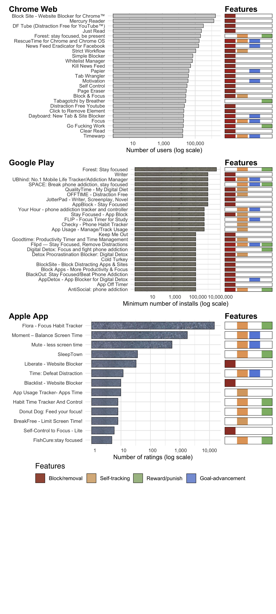

```{r setup, include=FALSE}
library(tidytext)
library(tidyverse)
library(readxl)
library(ngram)
library(scales)
library(ircor)

knitr::opts_chunk$set(echo = FALSE, message = FALSE, warning = FALSE)
options(scipen = 999)
```

# Introduction

The constant connectivity of smartphones and laptops provides innumerable benefits, but also unprecedented opportunities for distraction. 
Indeed, as the business models of many tech companies have come to rely on nudging people into using digital services extensively (cf. the 'attention economy' [@davenportAttentionEconomyUnderstanding2001; @einsteinBlackOpsAdvertising2016; @wuAttentionMerchantsEpic2016]), many people routinely struggle to exercise self-control over their device use [@coxDesignFrictionsMindful2016; @koNUGUGroupbasedIntervention2015; @marottaOnlineDistractionsWebsite2017; @tranModelingEngagementDisengagementCycle2019; @hinikerMyTimeDesigningEvaluating2016]. 
In HCI, a growing amount of research attempts to address this challenge by developing and evaluating design patterns that help users self-regulate[^1] [@lottridgeBrowserDesignImpacts2012; @kimGoalKeeperExploringInteraction2019; @pinderPushAwaySmartphone2019; @tsengOvercomingDistractionsTransitions2019; @mongeroffarelloRaceDigitalWellbeing2019; @lyngsSelfControlCyberspaceApplying2019].
This work is gradually building an understanding of how interventions ranging from ambient visualisations of time spent [@whittakerDonWasteMy2016] and distraction blocking [@kimGoalKeeperExploringInteraction2019] to goal-setting with social support [@koNUGUGroupbasedIntervention2015] can help people stay in control.

Most of this research has taken an experimental approach and compared user behaviour and perceptions when applying a given intervention to its absence and/or some alternate intervention [@lyngs2021]. 
In the present paper, we take an alternative approach. On online stores for apps and browser extensions, hundreds of 'digital self-control tools' (DSCTs) provide similar interventions that block apps or hide distracting website elements, track and visualise use, provide rewards or punishments for how devices are used, and much more [@lyngsSelfControlCyberspaceApplying2019]. User reviews and popularity metrics from these tools might provide valuable complementary information about the utility of different design patterns and implementations 'in the wild', and help scope future controlled studies. However, a limited number of studies have investigated what we might learn from this source of data.

Hence, in this paper, we explore how user reviews and other store information can contribute to HCI research on design patterns for digital self-control. Specifically, we analyse user reviews, functionality, installation numbers, and ratings for 334 DSCTs on the Google Play, Chrome Web, and Apple App stores (drawn from [@lyngsSelfControlCyberspaceApplying2019]), investigating user needs, contexts and purposes of use, and key design challenges.

Our analysis of user reviews found that DSCTs are seen as highly important to support focus on less instantly rewarding tasks when digital distractions are easily available, especially in contexts related to productivity (including work, studying, reading, and writing), and going to sleep. DSCTs seemed particularly useful for reviewers describing themselves as 'addicts' or otherwise struggling intensely with distraction, for example due to conditions like ADHD.

Reviewers wanted DSCTs to flexibly adapt to their personal definition of 'distracting use', as seen in common requests for customisation of *what* and *when* particular usage patterns should be blocked or tracked. One important reason was that DSCTs' interventions, useful as they may be, can elicit negative emotional reactions. This could cause their interventions to be counterproductive, especially if users perceived DSCTs' framing of distracting use to differ from their own.

Finally, reviewers wanted DSCTs to provide carefully calibrated support that is sufficient to support intended behaviour change without feeling too coercive. This 'Goldilocks level'[^2] varied between reviews, but most wanted DSCTs to provide support powerful enough to keep the user on track in moments of temptation or absentmindedness. Thus, blocking tools were often criticised if they were too easy to override because they could then fail to hold people accountable in moments of temptation. On the other hand, DSCTs were also criticised if their incentives were *too* strong, for example if blocking tools did not include some way to handle genuine emergency use, or if tools providing reward/punishment made users feel dejected when they failed to use their devices as intended.

One way DSCTs might provide properly calibrated support is by combining different types of design patterns (e.g., combining distraction blocking with goal-reminders). This was sometimes requested in the reviews, and tentatively supported by rating scores, where tools that combine two or more types of design patterns received higher ratings than those implementing a single type.

## Motivation and background

In recent years, HCI researchers have started to build an understanding of how specific design patterns intended to support self-regulation over digital device can influence user behaviour and perceptions [@whittakerDonWasteMy2016; @kimGoalKeeperExploringInteraction2019; @kimLocknTypeLockoutTask2019; @kovacsRotatingOnlineBehavior2018]. However, basic questions still remain open. These include *conceptual challenges* (e.g., what outcome measures we should seek to optimise, as simply measuring impact on 'screen time' is deemed inadequate by most researchers [@cecchinatoDesigningDigitalWellbeing2019; @hinikerMovingGreatScreen2019; @lukoffDigitalWellbeingWay2019]); related gaps in our understanding of *individual variation in user needs* (such as how how widely people differ in what they consider 'distracting' use [@cecchinatoDesigningDigitalWellbeing2019; @lukoffDigitalWellbeingWay2019]); and *practical implementation challenges* (such as how much 'friction' tools should apply to hold users accountable for their past preferences [@kimGoalKeeperExploringInteraction2019; @coxDesignFrictionsMindful2016; @lyngsTellMeWhat2018; @kimLocknTypeLockoutTask2019]).

One approach to addressing these questions is to evaluate new or existing interventions in lab and field studies. While this is appropriate and feasible for evaluating and comparing a small number of design patterns, it is difficult to scale to broadly assess a large numbers of patterns and implementations.

A complementary approach is to investigate the landscape of DSCTs available online. Here, hundreds of tools are exploring a wide range of strategies, from hiding or modifying content on distracting websites (e.g. *Newsfeed Eradicator* [@jdevNewsFeedEradicator2019]) or limiting the amount of functionality available on home screens (e.g. the Android app *LessPhone Launcher* [@mohanLessPhoneLauncher2019]), to gamifying self-control by tying device use to the wellbeing of virtual creatures (e.g. *Forest* [@seekrtechForestStayFocused2018]). Some of these tools have millions of users [@lyngsSelfControlCyberspaceApplying2019], and they effectively amount to a myriad of natural studies in which individuals self-experiment with tools that represent not only one or more design patterns, but specific ways to implement those patterns [@daskalovaSleepCoacher2018; @leeSelfExperimentation2017]. Indicators of the outcome of these experiments include user reviews, store ratings, and installation numbers, which can provide valuable information about the usefulness of different design patterns and implementations.

Other areas of HCI research have benefited from such an approach. For example, in mental health research, thematic analysis of user reviews has been used to explore factors important for optimising user experience and support engagement in apps for cognitive behavioural therapy [@bakkerMentalHealthSmartphone2016; @huguetSystematicReviewCognitive2016; @luiEvidencebasedAppsReview2017; @sucalaAnxietyThereApp2017; @stawarzUserExperienceCognitive2018]. However, few studies on digital self-control have taken this route: To the best of our knowledge, four published studies have described and/or categorised functionality in samples of DSCTs available online [@biskjaerTakingActionDistraction2016; @lyngsSelfControlCyberspaceApplying2019; @mongeroffarelloRaceDigitalWellbeing2019; @vanvelthovenProblematicSmartphoneUse2018]: Velthoven et al. [@vanvelthovenProblematicSmartphoneUse2018] presented aims and features in 21 tools identified via the software recommendation platform [alternativeto.net](https://alternativeto.net); Biskjær et al. [@biskjaerTakingActionDistraction2016] presented a taxonomy of functionality based on 10 tools from the Google Play, Chrome Web, and Apple App stores, and online tech magazines; Monge Roffarello & De Russis [@mongeroffarelloRaceDigitalWellbeing2019] presented a taxonomy of functionality based on 42 mobile apps from the Google Play store; and Lyngs et al. [@lyngsSelfControlCyberspaceApplying2019] presented a taxonomy of functionality based on 367 tools from the Google Play, Chrome Web and Apple App stores, which was mapped to psychological mechanisms in a dual systems model.

Only one of these studies analysed user reviews, namely Monge Roffarello & De Russis [@mongeroffarelloRaceDigitalWellbeing2019], which included thematic analysis of 1,128 reviews from 42 smartphone apps, and none incorporated popularity metrics. Moreover, Monge Roffarello & De Russis' analysis of user reviews was restricted to 42 apps drawn from the Google Play store and did not specify how the reviews were distributed across apps with different functionality. Thematic analysis is likely to yield different results depending on how reviews are sampled across tools with different functionality, and depending on the analysis strategy [@chenARminerMiningInformative2014; @braunThematicAnalysis2018]. Therefore, additional analyses with broader sampling of tools, and transparent sampling of reviews from those tools, might be helpful.

On this background, we extended existing studies of DSCTs by (i) scraping installation numbers, ratings, and user reviews from a broad sample of tools across different stores and types of functionality, (ii) analysing reviews using 'reflexive' thematic analysis [@braunThematicAnalysis2018], (iii) analysing popularity metrics' relationship to design patterns, and (iv) making our materials, analysis scripts and data openly available in the interest of transparency and reusability [@harozUpdatesCHISubmission2019].

# Methods

Data, analysis scripts, and materials for the present paper are available at <https://osf.io/cdqub/>.

We investigated the 367 digital self-control tools reviewed by Lyngs et al. [@lyngsSelfControlCyberspaceApplying2019], as this paper provided the largest available review of DSCTs. Lyngs et al. identified these tools by downloading search results on the Chrome Web, Google Play, and Apple App stores in August 2018 for the terms 'distraction', 'addiction', 'motivation', and 'self-control', individually as well as prefixed by 'internet', 'smartphone', and 'laptop'. From the initial results (4890 distinct apps and extensions), they included tools explicitly designed to help people self-regulate digital device use, resulting in 367 tools (222 browser extensions from Chrome Web, 87 apps from Google Play, and 58 apps from the Apple App store).[^3]

We adopted Lyngs et al.'s classification of functionality within these tools, which clustered functionality into four types of design patterns for digital self-control:

-   *block/removal* (features for blocking distractions, such as temporarily locking the user out of specific apps, or removing them in the first place, such as by hiding recommended videos on YouTube)

-   *self-tracking* (features for tracking and/or visualising device use, such as showing how much time the user has spent in particular apps or on devices overall, or letting the user start a countdown timer when they need to focus)

-   *goal-advancement* (features for reminding the user of their usage goals, such as displaying pop-ups when a specific amount of time has been spent, or replacing the content of new browser tabs with to-do lists)

-   *reward/punishment* (features that provide incentives for using devices in particular ways, such as rewarding the user with points/streaks when they do not use their phone)

## Collecting tool information and user reviews

In March 2019, we scraped additional information about these tools, including publicly available user reviews, as well as installation numbers, ratings, and store descriptions. For apps on the Google Play store, we used the open-source `google-play-scraper` [@olanoGoogleplayscraper2018] to scrape reviews and tool information. For apps on the Apple App store, we used the open-source `app-store-scraper` [@olanoAppstorescraper2018] to scrape reviews, and wrote our own R script (using the packages [`rvest`](https://rvest.tidyverse.org) and [`RSelenium`](http://ropensci.github.io/RSelenium/)) to scrape tool information. As the `app-store-scraper` sometimes failed to retrieve all reviews visible on tools' pages on the Apple App store, we wrote an additional R script to scrape reviews when manual inspection found some to be missing. For browser extensions on the Chrome Web store, we wrote our own R script to scrape both tool information and user reviews.

## Data and analysis approach

### User numbers and ratings

All stores displayed average ratings, as well as a count of how many ratings a tool had received. For installation numbers, the stores provided different information: the Chrome Web store provided an exact number of users, and the Google Play store provided a 'minimum number of installs' (e.g. '100,000+'). The Apple App store provided no direct information about user numbers. For processing that ranked tools by installation numbers, we used number of ratings as a proxy for relative numbers of users for tools from the Apple App store.

## Sampling and thematic analysis of user reviews

To get a broad coverage of reviews for tools across stores and types of design patterns, we wrote an R script to systematically sample user reviews for qualitative analysis from the scraped data. To ensure that the reviews analysed came from tools with a minimum level of engagement on the stores, we only sampled reviews from tools on the Google Play and Chrome Web stores that had at least 100 installations/users, and tools from the Apple App Store that had at least 5 ratings. To make the sampled reviews more likely to be informative, we excluded reviews shorter than 10 words. Our script iterated through the four types of design patterns described above, on each iteration picking the tool on each store that included that specific type of design pattern and which had the highest number of users (Google Play and Chrome Web) or ratings (Apple App store). The script then randomly sampled 30 user reviews from each of those tools (if a tool had fewer than 30 reviews, all of its reviews would be included), and started over. The script ran until at least 1,500 reviews were sampled in total. A specific tool could only have its reviews sampled once.

Next, we conducted inductive thematic analysis of the sampled reviews, following the 'reflexive' approach described in [@braunUsingThematicAnalysis2006] and [@braunThematicAnalysis2018]. Our work was informed by an earlier analysis of 961 reviews randomly sampled from the same data set by the lead author of this paper [@lyngs2021a ch. 4]. However, our analysis in the present paper was conducted from scratch, with a new sample of user reviews drawn in the manner described. After sampling reviews for analysis, the lead author (UL) read through them all and conducted initial coding of recurrent patterns relevant to the research focus. A second author (LC) read through one third of the reviews and independently coded recurrent patterns of meaning. Afterwards, these two authors read through the coded excerpts, recoded them, iteratively sorted the codes into potential themes, and discussed emerging themes.

Thematic coding was conducted using [NVivo](https://www.qsrinternational.com/nvivo-qualitative-data-analysis-software/home/) v1.6.1; all quantitative analyses were conducted in R v4.0.5 (see [osf.io/cdqub/](https://osf.io/cdqub/) for information on R package versions used).

# Results

```{r, include=FALSE}
meta_data <- read_csv(here::here("data", "processed", "meta_data_all_w_design_pattern_types.csv"))
original_tools <- read_csv(here::here("materials", "2018-12-30_lyngs_tools.csv"))

reviews_w_main_cat_data <- read_csv(here::here("data", "processed", "distinct_reviews.csv")) %>% 
  mutate(review_word_count = stringi::stri_count_words(review_text))

(num_missing <- original_tools %>% 
  filter(!(tool_id %in% meta_data$tool_id)) %>% 
  nrow())

(num_w_info_by_store <- meta_data %>% count(store))

## tools w reviews
got_reviews_from <- reviews_w_main_cat_data %>% 
  distinct(tool_id)

(num_tools_w_reviews_by_store <- reviews_w_main_cat_data %>% 
  distinct(tool_id, store) %>% 
  count(store))

(num_reviews_by_store <- reviews_w_main_cat_data %>% 
  count(store))

```

At the time of scraping, `r num_missing` tools from Lyngs et al.'s review had become unavailable. 
Hence, we scraped information for `r nrow(meta_data)` tools: 
`r num_w_info_by_store %>% filter(store == "chrome") %>% pull(n)` extensions from Chrome Web, `r num_w_info_by_store %>% filter(store == "play") %>% pull(n)` apps from Google Play, and `r num_w_info_by_store %>% filter(store == "apple") %>% pull(n)` apps from the Apple App store.

`r nrow(got_reviews_from)` of these tools had received user reviews (`r num_tools_w_reviews_by_store %>% filter(store == "chrome") %>% pull(n)` from Chrome Web, `r num_tools_w_reviews_by_store %>% filter(store == "play") %>% pull(n)` from Google Play, and `r num_tools_w_reviews_by_store %>% filter(store == "apple") %>% pull(n)` from the Apple App store). 
From these, we collected a total of `r format(nrow(reviews_w_main_cat_data), big.mark = ",")` reviews (`r num_reviews_by_store %>% filter(store == "chrome") %>% pull(n) %>% format(big.mark = ",")` from Chrome Web, `r num_reviews_by_store %>% filter(store == "play") %>% pull(n) %>% format(big.mark = ",")` from Google Play, and `r num_reviews_by_store %>% filter(store == "apple") %>% pull(n) %>% format(big.mark = ",")` from the Apple App store).

## User reviews

(ref:word-cloud-caption) Word cloud depicting frequencies of terms across all `r format(nrow(reviews_w_main_cat_data), big.mark = ",")` reviews. Font size indicates relative frequency. The word cloud excludes the terms 'app/s', 'phone', and 'extension', as well as stop words (i.e., extremely common words unlikely to be informative such as "the", "of", "to", etc. Stop words were excluded using the R package `tidytext` [@silge2016tidytext]). Colouring is aesthetic and does not map to any characteristics of the data.

```{r wordcloud, fig.cap="(ref:word-cloud-caption)", out.width='100%'}
knitr::include_graphics("figures/wordcloud.png")
```

```{r, include=FALSE}
(num_reviews_summary <- reviews_w_main_cat_data %>% 
  group_by(tool_id) %>% 
  summarise(num_reviews = n()) %>% 
  summarise(mean = mean(num_reviews),
            min = quantile(num_reviews, 0),
            q25 = quantile(num_reviews, 0.25),
            median = quantile(num_reviews, 0.5),
            q75 = quantile(num_reviews, 0.75),
            max = quantile(num_reviews, 1)))

(word_count_summary <- reviews_w_main_cat_data %>% 
  summarise(mean = mean(review_word_count),
            min = quantile(review_word_count, 0),
            q25 = quantile(review_word_count, 0.25),
            median = quantile(review_word_count, 0.5),
            q75 = quantile(review_word_count, 0.75),
            max = quantile(review_word_count, 1)))

(ptc_app <- reviews_w_main_cat_data %>% 
  mutate(has_app = str_detect(review_text, "app")) %>% 
  count(has_app) %>% 
  mutate(ptc = (n/sum(n))*100) %>% 
  filter(has_app == TRUE) %>% 
  pull(ptc) %>% 
  round())

(ptc_time <- reviews_w_main_cat_data %>% 
  mutate(has_time = str_detect(review_text, "time")) %>% 
  count(has_time) %>% 
  mutate(ptc = (n/sum(n))*100) %>% 
  filter(has_time == TRUE) %>% 
  pull(ptc) %>% 
  round())
```

For the tools that had received reviews, the median number of reviews was `r num_reviews_summary$median` (min = `r num_reviews_summary$min`, max = `r num_reviews_summary$max`, IQR = `r num_reviews_summary$q25` to `r round(num_reviews_summary$q75)`), 
and the median number of words was `r word_count_summary$median` (min = `r word_count_summary$min`, max = `r word_count_summary$max`, IQR = `r word_count_summary$q25` to `r word_count_summary$q75`; reviews containing only emojis have a word count of 0). 
Figure \@ref(fig:wordcloud) shows the overall frequency of terms used in the reviews, excluding the terms 'app/s', 'phone' and 'extension' as well as common stop words ('the', 'of', 'to', etc.; excluded using the R package `tidytext` [@silge2016tidytext]). 
Aside from 'app' (`r ptc_app`% of reviews), the most frequent term was 'time', which was used in `r ptc_time`% of all reviews. The terms most commonly following or preceding 'time' included 'limit', 'usage', 'spent', 'screen', 'waste', and 'management', suggesting that managing time spent on digital devices was a central topic (which could reflect users' interests or preferences and/or that currently available tools simply focus on this).

```{r review-bigrams, eval=FALSE}
review_bigrams <- reviews_w_main_cat_data %>% 
  unnest_tokens(bigram, review_text, token = "ngrams", n = 2)

bigrams_separated <- review_bigrams %>%
  separate(bigram, c("word1", "word2"), sep = " ")

bigrams_filtered <- bigrams_separated %>%
  filter(!word1 %in% stop_words$word) %>%
  filter(!word2 %in% stop_words$word)

bigram_counts <- bigrams_filtered %>% 
  count(word1, word2, sort = TRUE)

```

### Thematic analysis

```{r, include=FALSE}
reviews_for_ta <- read_excel(here::here("data", "processed", "2022-01-22-reviews_for_ta.xlsx"))

num_tools_within_categories <- reviews_for_ta %>% 
  distinct(categories_alphabetically, tool_id) %>% 
  group_by(categories_alphabetically) %>% 
  summarise(num_tools = n())

num_reviews_within_categories <- reviews_for_ta %>% 
  group_by(categories_alphabetically) %>% 
  summarise(num_reviews = n())
```


We conducted thematic analysis of `r nrow(reviews_for_ta)` reviews from a total of `r reviews_for_ta %>% distinct(tool_id) %>% nrow()` different tools (Table \@ref(tab:sampled-reviews) shows how the reviews were distributed across tools with different combinations of design patterns).
In the following, we accompany review quotes with the name of the tool the review was for, alongside an indication of which types of design patterns the tool included, and which store it came from:

-   \typeBlock\hspace{1mm}= block/removal, \typeTrack\hspace{1mm}= self-tracking,\
    \typeGoal\hspace{1mm}= goal-advancement, \typeReward\hspace{1mm}= reward/punish
    
-   C = Chrome Web, P = Google Play, A = Apple App store

-   Example review quote from a Chrome Web tool including design patterns for block/removal, self-tracking, and goal-advancement: *"It would be nice to make it hard to disable, something like a simple maths problem that we could change difficulty, so I am not tempted."*, R1408, Timewarp \typeBlock\typeTrack\typeGoal \textbf{C}

(ref:ta-reviews-by-design-patterns) Reviews sampled for thematic analysis (total n = 1,529), by design patterns included in the tools.

```{r sampled-reviews}
# create a table with the count of tools and review from each combination of functionality
num_tools_within_categories %>% 
  left_join(num_reviews_within_categories) %>% 
  mutate(num_categories = str_split(categories_alphabetically, "\\+")) %>% 
  rowwise() %>% mutate(num_categories = length(num_categories)) %>% ungroup() %>% 
  arrange(num_categories, categories_alphabetically) %>% 
  mutate(`Colour code` = categories_alphabetically %>% str_replace("Block/removal", "\\\\typeBlock") %>% str_replace("Reward/punish", "\\\\typeReward") %>% str_replace("Self-tracking", "\\\\typeTrack") %>% str_replace("Goal-advancement", "\\\\typeGoal") %>% str_remove_all(" \\+ ")) %>% 
  select("Design patterns included in DSCT" = categories_alphabetically,
         "Colour code",
         "Number of tools" = num_tools,
         "Number of reviews" = num_reviews) %>% 
  knitr::kable(caption = "(ref:ta-reviews-by-design-patterns)", escape = FALSE) %>% 
  kableExtra::landscape()

```


Our early codes were 'domain summaries' [@braunThematicAnalysis2018] organised in an evolving hierarchy of sub-codes. For the first coder (UL), early codes were organised as sub-codes of usage contexts and benefits, user characteristics, key design patterns, and praise or criticism of the developer or app. 
For the second coder (LC), early codes were organised as sub-codes of feature requests, positive feedback, negative feedback, and reasons for use.

An early observation as we explored reported benefits of use was that a substantial proportion of reviews expressed highly positive and important impact of the tools used (n = 480, 22% of reviews). Thus, the reviews described a common feeling of lacking control over digital device use, which resulted in using devices in unintended ways, or in using them so much that it interfered with other goals. However, digital self-control tools were seen as effectively helping reviewers take back control, save time, and make their device use fit better into their lives (*"I can happily say that this extension has changed my life!!!! It hides EVERY ANNOYING YouTube feature"*, R385, DF Tube \typeBlock \textbf{C}, *"Has saved me countless hours of time-wasting nonsense"*, R1000, NewsFeed Eradicator for Facebook \typeBlock \typeGoal \textbf{C}). Many expressed deep appreciation towards the developers as a result ("Who so ever is working behind this software, my deepest gratitude to them", R271, BlockSite \typeBlock \textbf{C}). Some reviewers seemed surprised that particular tools had been useful to them (*"I added it more as a joke, but it's really good and helpful for those hours you're supposed to study and don't want to be distracted"*, R675, Go Fucking Work \typeBlock \typeReward \textbf{C}). Importantly, the reviews also contained a wealth of information on how specific implementations of design patterns could fail to fulfil their purpose, and how they might be improved.

```{r, include=FALSE}
theme_one <- "DSCTs as essential for focusing on less instantly rewarding tasks when digital distractions are easily available"
theme_two <- "DSCTs should flexibly adapt to personal definitions of 'distraction'"
theme_three <- "DSCTs should provide a level of support that is sufficient to change behaviour without feeling too coercive."
```

As we iteratively worked with the codes and excerpts, we developed three broad themes capturing digital self-control tools' (DSCTs) use contexts and design challenges, assembled from recurrent patterns in the early codes: 
(i) `r theme_one`, (ii) `r theme_two`, (iii) `r theme_three`
The NVivo files with our early codes, and their later re-organisation by relation to the three main themes, as well as exports of the code hierarchy to other formats, are available on [osf.io/cdqub/](https://osf.io/cdqub/).

#### **Theme 1: `r theme_one`**

A fair number of reviews described reduced time on devices overall or on specific services as the reason why DSCTs were helpful (n = 51, 3.3% of reviews). More commonly than limiting time *per se*, however, DSTCs were described as useful because they helped people focus on a specific task amidst easily available distractions on their devices (n = 212, 14%).

Many reviews described their challenges in this respect as caused by time-wasting patterns of habitual or impulsive use, exacerbated by distracting or 'addictive' design patterns and other adversarial dynamics online. However, DSCTs provided essential countermeasures that reviewers had searched for (*"Was looking for a solution for this for over 1 year"*, R771, Inbox When Ready for Gmail \typeBlock\typeGoal\typeTrack \textbf{C}; *"Should be on all phones as standard"*, R982, Mute Screen Time Tracker \typeGoal\typeTrack \textbf{A}), and many reviewers noted that they had experimented with different tools (n = 80, 5%). DSCTs seemed especially helpful when avoiding use of a distracting service was not an option (*"This helps me avoid the mind numbing news feed that is of Facebook when work has to be done on Facebook itself"*, R873, Kill News Feed \typeBlock \textbf{C}).

The need for support from DSCTs to stay focused seemed especially acute when tasks were important, but less instantly rewarding than the alternatives. Thus, many reviewers generically stated that DSCTs benefited them in productivity/work contexts (n = 167, 11%; *"Not being distracted by unread/misc emails has proven to be of significant benefit to my productivity"*, R776, Inbox When Ready for Gmail \typeBlock \typeGoal \typeTrack \textbf{C}), including studying, writing, or reading (n = 90, 6%). Some reviews expressed this as DSCTs helping overcome 'procrastination' (\textit{seeing [my short-term to-do list] nudges me to get back to work when I am opening a new website to procrastinate}, R324, Dayboard \typeBlock \typeTrack \textbf{C}).

Another important use context was *sleep*, where some reviewers said their digital devices interfered with going to bed at the intended time. However, DSCTs helped them adjust their habits in favour of the sleep patterns they wanted (*"I always used to stay up really late on my phone until I got this app - I have consistently been getting 9 hours sleep and waking up early for the first time in my life !!"*, R1252, SleepTown \typeTrack \typeReward \textbf{P}; *"It really forces me to stay off to the phone, and so it's useful especially when I need to go to bed"*, R198, BlackOut \typeBlock \textbf{P}).

In these situations, DSCTs helped reviewers stay in control by reminding them of what they wanted to do, by reducing exposure to 'temptations' (*"Without it, it is too easy for me to be tempted to view and open YouTube sidebar links"*, R376, DF Tube \typeBlock \textbf{C}), or by providing incentives for intended use (*"Not only does it help me stay focused, I smile with delight looking at all my trees and flowers at the end of the day"*, R642, Forest \typeTrack \typeReward \textbf{C}).

**Sub-theme: DSCTs as especially useful for people with more acute self-regulation challenges** In an extension of the main theme, DSCTs seemed especially useful for individuals who experience self-regulation challenges more intensely (n = 53, 3.5%). This was commonly expressed as a tool being helpful for tackling 'addiction', and/or as reviewers labelling themselves 'addicts', 'procrastinators' or just low in self-control (*"This was the perfect solution to my phone addiction. It was consuming my life and my free time"*, R612, Forest \typeTrack \typeReward \textbf{P}). Occasionally, reviews used clinical labels like ADD or ADHD to explain why tools had been helpful (*"As someone with ADHD, the pomodoro technique has been super effective"*, R615, Forest \typeTrack \typeReward \textbf{P}).

#### **Theme 2: `r theme_two`**

DSCTs needed to accurately capture users' personal definitions of 'distracting use' to be helpful (n = 243, 16%), a theme often expressed in the form of feature suggestions that would make tools more customisable.

One aspect involved getting tools to accurately capture *what* was considered a distraction. Thus, **self-tracking** tools often received feature requests for the ability to exempt specific functionality from tracking because not all use represented use that reviewers wanted support in managing (*"I use a meditation app and can be meditating several times a day, sometimes up to an hour at a time, so as it doesn't distinguish between that and social media it gives a false impression of"usage" "*, R989, Mute Screen Time Tracker \typeGoal \typeTrack \textbf{A}).

Similarly, for **block/removal** tools, reviewers wanted to be able to customise which apps or websites were targeted, or target blocking to specific functionality (*"I would like to block reddit but still be able to visit productivity related subreddits"*, R1401, Timewarp \typeBlock \typeTrack \typeGoal \textbf{C}). DSCTs on iOS in particular struggled to provide blocking catered to users' needs, because Apple's restrictive developer permissions do not easily allow apps to block other apps. Therefore, iOS tools that provide blocking tended to be limited to blocking websites within the Safari browser. Sometimes, users did not realise this limitation at first, and went on to express their frustration in reviews (*"I thought the app would be linked to the apps on my phone I intended to block. So disappointed"*, R878, Liberate \typeBlock \textbf{A}). A workaround provided by one 'blocking' app, was to generate random passwords that would be shown only once (Self-Control to Focus - Lite \typeBlock ). This app instructed users to go to apps they wanted to block, change their account passwords to the randomly generated one without memorising it, then log out out of their accounts (!). The app would show users the password again on a set date, until which they would be unable to log back into their accounts.

Another aspect involved *when* specific activities should count as distractions. For example, tools for curbing nightly use received feature requests to handle variation in bedtime schedules (*"it needs to allow for the real life fact that people can't go to bed and wake up at the same time everyday. If it was done on your amount of sleep you get in hours that would be better"*, R1250, SleepTown \typeTrack \typeReward \textbf{A}).

**Sub-theme: Alignment between user and tool as important for navigating negative emotions** Aside from practical reasons that DSCTs should accurately capture behaviour that reviewers wished to change, an important factor seemed to be the negative emotions that interventions could elicit (n = 30, 2%). Thus, whereas the various restrictions and reminders provided by DSCTs were seen as helpful and important, users also needed to carefully navigate the emotional reactions they could create (\textit{"I hate it and love it at the same time. \emojiTearsOfJoy"}, R1299, Stay Focused \typeBlock \typeTrack \textbf{P}, *"Pisses me off sometimes, but worth it"*, R357, Detox Procrastination Blocker, \typeBlock \typeTrack \textbf{P}).

In order for experiences of "shock", "pressure", etc., to be useful, it was important that the user felt that a DSCT's purpose and framing of usage were closely aligned with their personal perspective. Thus, tools that provided standards for 'good' or 'bad' usage, for example in their presentation of usage statistics or reminder pop-ups, needed to tread carefully. Being reminded that one did not behave in line with one's intentions could be very helpful (*"This tells it like I need to be told sometimes\...LOVE IT! Simple and effective :)"*, R690, Go Fucking Work \typeBlock \typeReward \textbf{C}; *"I like the guilt trip it gives me if I attempt to get into facebook or other social networks"*, R311, Dayboard, \typeBlock \typeGoal \textbf{C}). However, normative messaging could backfire and be profoundly annoying if reviewers did not agree with it (*"I was a bit annoyed when Big Brother started getting judgemental on me. "You have hit your target of 50 pickups!" "You've now picked up your phone 90 times!" Well, first I didn't set a target, and second, I don't think that 54 minutes across a day should make me feel guilty. Especially since I was reading a book during that time"* R911, Moment \typeGoal \typeTrack \textbf{A}).

#### **Theme 3: `r theme_three`**

Reviewers searched for DSCTs that provided support which was 'just right' to bring about an intended change in behaviour without feeling too coercive (n = 271, 18%). The reviews implied a spectrum of individual differences in where this 'Goldilocks level' was. A few reviewers stated that simply knowing that a tracking tool was monitoring them was sufficient (*"I know it's tracking me so I pick up the phone a lot less"*, R992, *Mute Screen Time Tracker* \typeGoal \typeTrack \textbf{A}). Commonly, however, reviewers wanted DSCTs to provide more strict or persuasive ways to hold themselves accountable, so that they did not succumb to temptations or unwanted habits in moments of weakness or absentmindedness (n = 132, 9%). The specifics differed for different design patterns.

For patterns related to **distraction blocking/removal**, it was important that blocking was not too easy to disable in moments of temptation (*"This is fantastic but the thing is I can simply remove the extension from chrome which defeats the purpose. Does anyone know how I can stop myself from removing the extension?"*, R1217, Simple Blocker \typeBlock \textbf{C}). On the other hand, if blocking was *too* difficult to disable, it would be criticised for failing to account for emergencies or otherwise unforeseen circumstances. One developer followed reviewers' suggestion to add a 'pause' button, only to then receive critique that blocking was now too easy to turn off. Reviewers suggested that adding friction to turn off blocking would provide a solution, such as being required to complete a time-consuming or effortful task (*"make it necessary to touch the screen for a minute or 2 so that it becomes harder for anyone to stop it"*, R8, ( OffTime ) \typeBlock \typeTrack \textbf{P}), or type in a password that could be set by a trusted other.

Another aspect was that the amount of effort required to *initiate* use of blocking tools should be low, because users' initial motivation might be lacking (*"Most users have procrastination issues which make them postpone the moment in which they will click on the "Start focusing" button"*, R545, Focus \typeBlock \typeGoal \typeTrack \textbf{C}).
Thus, many feature requests asked for the ability to set a schedule where blocking would turn on automatically (\textit{``can I request an automatic start time option? So every M-F, 9-5 the app starts working automatically? I need it to cut me off from whatever dumb thing I'm doing before work starts :)'', R238, Block \& Focus \typeBlock\typeTrack \textbf{C}}).
An interesting suggestion for tools alternating 'focus' and 'break' sessions, was to flip the order to begin with a break, followed by enforced blocking. This might lower the amount of motivation needed to initiate a focus session (*"Hitting the start button the very first time is hard! Starting in a short break would allow me to hit this without a second thought, because I have a few short moments to surf before the focus is forced."*, R232, Block & Focus \typeBlock \typeTrack \textbf{C}).

For **reward/punishment** design patterns, reviewers sometimes suggested ways to increase the incentives provided to make tools more effective (*"If I could also name the trees (so I'll feel even worse about letting them die) it would be even better!"*, R650, Forest \typeTrack \typeReward \textbf{C}). Here too, however, tools needed to find the right balance. If a punishment was perceived as *too* harsh, it might make users feel dejected (*"I hate the fact that we get a destroyed building (...) I feel like it is too punishing and almost says 'you've failed' "*, R1247, SleepTown \typeTrack \typeReward \textbf{P}).

For **goal advancement** patterns, the 'just right' level of support mainly related to the frequency with which users could be reminded of their goals: too infrequent, and users might fail to complete their tasks; too frequent, and users would get annoyed. For example, one browser extension replaced the content of new tabs with to-do lists, and also provided task reminders via pop-ups. This tool was on the one hand criticised for dropping unfinished tasks from the day before, as users would then forget those tasks. On the other hand, its pop-up reminders were criticised for being too frequent (*"the todo popup on each page load is quite useful (\...) it should be limited (across multiple tabs) to only pop-up every minute or so (\...) I find myself snoozing it too often just because the popup bothers me"*, R339, Dayboard, \typeBlock \typeGoal \textbf{C}).

For **self-tracking** patterns, reviewers commonly said that DSCTs implementing this helped them understand and assess their usage, which was often described as the first step in changing behaviour. However, many reviews said that it was not in itself sufficient support to change, and that tracking needed to be combined with other strategies to be effective (*"It does not stop me spending 10 hours on Facebook but it does inform me (\...) What has worked great is using rescue time with very intentional time blocking"*, R1157, RescueTime, \typeTrack \typeGoal \typeBlock ). We elaborate on this in the sub-theme below.

Similarly to the challenges around blocking, self-tracking tools on iOS faced an additional challenge related to the amount of user effort required to track use in the first place. This occurred because Apple's developer permissions do not allow apps to easily track time spent in other apps. As a work-around, some tools required users to take screenshots of their phone's battery page, from which information about time spent in different apps could be extracted. This work-around was, however, seen as too effort-demanding by reviewers (*"I should have looked at how you use this. Take a picture everyday????? Really?"*, R121, App Usage Tracker \typeTrack \textbf{A}).

**Sub-theme: Combining design patterns to find the Goldilocks level of support** Rather than simply focusing on the parameters of individual design patterns, some reviews focused on how a *combination* of different types of patterns could make DSCTs provide the right level of support for behaviour change. For example, some reviews for self-tracking tools suggested that adding a goal-setting or blocking element might make it more effective. Similarly, some reviewers wanted block/removal tools to not simply block distractions, but also actively nudge them in ways that supported intended habits. This might happen by, for example, redirecting blocked websites to productive alternatives, or replacing recommender feeds with content people wanted to engage with more ("*if, where the home-screen recommended section is, this could be replaced by a website of our choice* (...) *This way I could do music theory, or learn German. Things I always intend to do, but don't do enough. But if these things came up every time I log into Youtube I'd definitely use them."*, R372, DF Tube \typeBlock \textbf{C}). Similarly, some reviews suggested that a particular tool's combination of design patterns was what made it more effective than alternative tools (*"This is the first todo list that actually keeps me on task. Normally I go down the rabbit burrow when working and either get way too focused on one task or completely go off track. This tool keeps pulling my attention back to the task list where I can make sure I'm not off track."*, R550, Focus \typeGoal\typeBlock\typeTrack \footnote{Focus replaces new tab content with a to-do list and activity log, alongside a 'start focusing' button. When the button is clicked, a 25 min work session is started where websites on a blacklist are blocked. If the user tries to access a blocked website, a countdown timer is shown. At the time of writing, this extension is no longer available on the Chrome Web Store.}).

## User numbers and ratings

```{r tool-num-users-and-ratings-plot, fig.cap="Distributions of installation numbers and number of ratings for DSCTs on the Google Play (n=71), Chrome Web (n=212), and Apple App (n=51) stores. Values are shown on a log scale --- tools with zero ratings are scored as having 0.5 ratings, so that they show in the plot. The Apple App store provided no direct information about installation numbers.", out.width='100%'}
to_visualise <- meta_data %>% 
  mutate(installs = case_when(
    store == "play" ~ min_installs,
    store == "chrome" ~ num_users,
    store == "apple" ~ NA_real_
  )) %>% 
  select(tool_id, store, installs, num_ratings) %>% 
  pivot_longer(-c(tool_id, store)) %>% 
  mutate(name = case_when(
    name == "installs" ~ "Min. installs (Google Play) / Users (Chrome Web)",
    name == "num_ratings" ~ "Number of ratings")) %>% 
  mutate(store = factor(store, levels = c("play", "chrome", "apple")),
         name = factor(name))

to_visualise %>% 
  mutate(value = if_else(value == 0, 0.5, value)) %>% # the log transformation removes tools with 0 ratings
  ggplot() +
    aes(x = store, y = value) +
    geom_boxplot(outlier.shape = NA, aes(fill = store), position = position_dodge2(preserve = "single"), alpha = 0.3) +
    scale_y_log10(labels=comma_format(accuracy=1), breaks = c(1, 10, 1000, 100000, 10000000)) +
    geom_jitter(aes(color = store), width = 0.2, height = 0, alpha = 0.5) +
    labs(x = "", y = "") +
    facet_wrap(~name) +
    guides(fill=FALSE, color = FALSE) +
    theme_minimal()

#ggsave("figures/tool-num-users-and-ratings-plot.pdf", width = 7, height = 5)
```

(ref:top-tools-caption) Top tools in terms of installation numbers (Chrome Web and Play) or number of ratings (Apple App store). Only 13 of the Apple App store tools had received ratings. Differences between the stores in terms of design patterns are readily apparent: Block/removal patterns are particularly common on the Chrome Web store (87% of all tools), where browser extensions can easily modify distracting elements on web pages. Reward/punishment patterns are included in 43% of tools on the Apple App store, compared to, respectively, 6 and 15% on the Chrome Web and Play stores.

```{r users-and-category, fig.cap="(ref:top-tools-caption)", out.width="70%", fig.align='center'}

```

```{r user_stats, include=FALSE}
(play_user_stats <- meta_data %>% 
  filter(store == "play") %>% 
  summarise(min_min_installs = quantile(min_installs, 0),
            q25_min_installs = quantile(min_installs, 0.25),
            median_min_installs = quantile(min_installs, 0.5),
            q75_min_installs = quantile(min_installs, 0.75),
            max_min_installs = max(min_installs)))
  
(chrome_user_stats <- meta_data %>% 
  filter(store == "chrome") %>% 
  summarise(min_installs = quantile(num_users, 0),
            q25_installs = quantile(num_users, 0.25),
            median_installs = median(num_users),
            q75_installs = quantile(num_users, 0.75),
            max_installs = max(num_users)))

(num_ratings_apple <- meta_data %>% 
  filter(store == "apple") %>% 
  summarise(min = quantile(num_ratings, 0),
            q25 = quantile(num_ratings, 0.25),
            median = quantile(num_ratings, 0.5),
            q75 = quantile(num_ratings, 0.75),
            max = max(num_ratings, na.rm = TRUE)))

(ratings_overall <- meta_data %>% 
  filter(num_ratings >= 1) %>% 
  summarise(min_rating = quantile(average_rating, 0),
            q25_rating = quantile(average_rating, 0.25),
            median_rating = quantile(average_rating, 0.5),
            q75_rating = quantile(average_rating, 0.75),
            max_rating = max(average_rating, na.rm = TRUE)))

```

The distribution of numbers of users/installations and ratings are shown in Figure \ref{fig:tool-num-users-and-ratings-plot}.
For Google Play tools, the median 'minimum number of installs' was `r format(play_user_stats$median_min_installs, big.mark = ",")` (min = `r format(play_user_stats$min_min_installs, big.mark = ",")`, max = `r format(play_user_stats$max_min_installs, big.mark = ",")`, IQR = `r format(play_user_stats$q25_min_installs, big.mark = ",")` to `r format(play_user_stats$q75_min_installs, big.mark = ",")`). 
For Chrome Web tools, the median number of users was `r format(chrome_user_stats$median_installs, big.mark=",")` (min = `r format(chrome_user_stats$min_installs, big.mark=",")`, max = `r format(chrome_user_stats$max_installs, big.mark=",")`, IQR = `r format(chrome_user_stats$q25_installs, big.mark=",")` to `r format(round(chrome_user_stats$q75_installs), big.mark=",")`). 
The Apple App store did not display information about number of users (the median number of ratings for DSCTs from the Apple App store was `r format(num_ratings_apple$median, big.mark=",")`; max = `r format(num_ratings_apple$max, big.mark=",")`, IQR = `r format(num_ratings_apple$q25, big.mark=",")` to `r format(num_ratings_apple$q75, big.mark=",")`). 
The median average rating across all tools was `r format(ratings_overall$median_rating, big.mark=",")` (min = `r format(ratings_overall$min_rating, big.mark=",")`, max = `r format(ratings_overall$max_rating, big.mark=",")`, IQR = `r format(round(ratings_overall$q25_rating), nsmall=1)` to `r format(round(ratings_overall$q75_rating), nsmall=1)`; ratings given on a scale from 1 to 5 stars on all stores).

(ref:caption-ratings-by-functionality) Average ratings by design patterns in digital self-control tools (for tools with 15 or more ratings). Tools including more than one type of design pattern had higher average ratings (median = 4.39) than tools implementing a single type (median = 4.2, *p* = 0.003, Wilcoxon's rank-sum test).

```{r, average-ratings-by-functionality, fig.cap="(ref:caption-ratings-by-functionality)", out.width="100%"}
knitr::include_graphics("figures/ratings_by_type_annotated.pdf")
```

```{r, include=FALSE}
chrome_and_play_rankings <- meta_data %>% 
  filter(num_ratings >= 30) %>% 
  group_by(store) %>% 
  mutate(installs = case_when(
    store == "chrome" ~ num_users,
    store == "play" ~ min_installs
  )) %>% 
  select(store, tool_id, average_rating, installs) %>% 
  mutate(rank_rating = rank(desc(average_rating)),
         rank_installs = rank(desc(installs)))

cor.test(chrome_and_play_rankings %>% filter(store == "chrome") %>% pull(rank_rating),
      chrome_and_play_rankings %>% filter(store == "chrome") %>% pull(rank_installs), 
      method = "kendall")

cor.test(chrome_and_play_rankings %>% filter(store == "play") %>% pull(rank_rating),
      chrome_and_play_rankings %>% filter(store == "play") %>% pull(rank_installs), 
      method = "spearman")

meta_data %>% 
  mutate( has_blocking = str_detect(categories_alphabetically, "Block/removal")) %>% 
  group_by(store, has_blocking) %>% 
  summarise(number = n()) %>% 
  mutate(prop = number / sum(number)) %>% 
  filter(has_blocking == TRUE)


meta_data %>% 
  mutate( has_goal = str_detect(categories_alphabetically, "Goal-advancement")) %>% 
  group_by(store, has_goal) %>% 
  summarise(number = n()) %>% 
  mutate(prop = number / sum(number)) %>% 
  filter(has_goal == TRUE)

meta_data %>% 
  mutate( has_track = str_detect(categories_alphabetically, "Self-tracking")) %>% 
  group_by(store, has_track) %>% 
  summarise(number = n()) %>% 
  mutate(prop = number / sum(number)) %>% 
  filter(has_track == TRUE)

meta_data %>% 
  mutate( has_reward = str_detect(categories_alphabetically, "Reward/punish")) %>% 
  group_by(store, has_reward) %>% 
  summarise(number = n()) %>% 
  mutate(prop = number / sum(number)) %>% 
  filter(has_reward == TRUE)
```

```{r number-of-design-patterns, include=FALSE}
meta_data %>% 
  count(num_categories) %>% 
  mutate(prop = n/sum(n))

data_test_one_vs_two <- meta_data %>% 
    filter(num_ratings >= 15) %>% 
    mutate(num_categories = as.numeric(num_categories),
           num_categories_one_or_more = ifelse(num_categories == 1, "1", "2-4"))

wilcox.test(average_rating ~ num_categories_one_or_more, data = data_test_one_vs_two)

(median_one <- data_test_one_vs_two %>% filter(num_categories_one_or_more == "1") %>% pull(average_rating) %>% median(na.rm = TRUE))
(median_two_to_four <- data_test_one_vs_two %>% filter(num_categories_one_or_more == "2-4") %>% pull(average_rating) %>% median(na.rm = TRUE))

```

Figure \@ref(fig:users-and-category) shows the top tools, ranked by number of users (Chrome Web and Play) or number of ratings (Apple App store), alongside the design patterns they include. 
Across all tools, 64% included a single type of design pattern for digital self-control, whereas 32% combined two. Very few combined three (3%, n = 11) or all four (1%, n = 2). Tools that combined two or more types had slightly higher average ratings than tools which implemented a single type (median average rating with a single type = 4.2, median for tools combining two or more = 4.39, *p* = 0.003 in Wilcoxon's rank-sum test; excluding tools with fewer than 15 ratings; see Figure \@ref(fig:average-ratings-by-functionality)).

On the Chrome Web and Play stores, Block/removal was the most common type of design pattern (included in 87% and 65% of all tools, respectively, compared to 37% on the Apple App store), whereas Reward/punishment was the least common (included in 6% and 15% of tools, respectively, compared to 43% on the Apple App store). Notably, the app 'Forest' (which combines reward/punishment and self-tracking in the form of virtual trees that grow while a timer counts down) ranked highest on the Play store and 5th on the Chrome Web store, while a very similar app, 'Flora', ranked highest on the Apple App store in terms of number of ratings received.


# Discussion

To sum up, reviewers described DSCTs as effective means of taking back control and making device use fit better with their lives. A fair number of reviews suggested that limiting time spent on devices, or on specific apps or services, was an important purpose for using DSCTs. More commonly than limiting time *per se*, however (observed four times as frequently in our thematic analysis), DSCTs were specifically used for focusing on less instantly rewarding tasks amidst easily available digital distractions. Specific contexts of use included productivity (including work, studying, reading, and writing), as well as bedtime habits. DSCTs seemed to be especially useful for individuals with higher baseline levels of self-regulation difficulties, as suggested by reviews who framed usefulness in terms of coping with 'addiction' or conditions like ADHD.

Reviewers wanted DSCTs to provide interventions that accurately targeted specific patterns of use. This was often expressed in the form of feature requests for, for example, being able to target blocking on a certain functionality on a website, or exempt specific apps from usage tracking. A contributing factor in this respect was that DSCTs' interventions could cause negative emotional reactions in the moment of temptation. If user and tool were not in agreement on their definitions of 'distracting use', interventions might simply be considered too annoying.

Reviewers also wanted DSCTs to provide a level of support that was sufficient for effecting their intended change in behaviour, without feeling too coercive. Reviewers differed in the level of support they wanted, but commonly looked for interventions strict or rewarding enough to stay on track when they felt tempted to indulge in digital distractions or drift into unwanted habitual use. DSCTs needed to strike a delicate balance in this respect, because overly strong incentives might backfire if they made users feel dejected when they failed, or if they did not allow for emergency use or shifting daily schedules.

Some reviewers suggested that combining different types of design patterns was an effective way to provide a level of support that was 'just right'. This matched the observation that DSCTs which combined two or more types of design patterns received slightly higher overall ratings than tools including only one. A final consideration related to how much effort a tool required to use: whereas high effort to *stop* a tool could help hold users accountable to their goals, the level of effort required to *start* use should be low, to handle potential lack of motivation to initiate blocking on part of the user.

In the following, we discuss implications for design and opportunities for future research.

## Goldilocks principles for DSCTs

Across different design dimensions, users' desired level of support from DSCTs reflected a Goldilocks principle: 'too little' and a DSCT would fail to bring about an intended change in behaviour; 'too much' and it could make the user feel frustrated, annoyed, or dejected. The considerations for a 'just right' level of support varied for different design dimensions: For example, for distraction blocking/removal the main concern was *how much effort* the user needed to apply to circumvent the blocking. For goal-advancement, it was *how frequently* users were reminded of their goals. In designing for a Goldilocks level of support, developers therefore need to consider more than a single dimension of engineered 'friction' [@coxDesignFrictionsMindful2016; @gouldSpecialInterestGroup2021]. How might we conceptualise Goldilocks principles for different design dimensions and assess the level of support that a DSCT provides?

### Using a dual-systems model to frame the Goldilocks level of support

The dual-systems model commonly used in psychology and HCI provides insight into how DSCTs support or disrupt target behaviors through multiple cognitive pathways. Lyngs et al. [@lyngsSelfControlCyberspaceApplying2019] originally used this model (Figure \@ref(fig:simple-cog-model)) to analyse how the four main types of design patterns in DSCTs support self-regulation. We suggest that it is also useful for understanding Goldilocks principles for those design patterns.

(ref:simple-cog-caption) A simplified dual-systems model of self-regulation, based on [@lyngsSelfControlCyberspaceApplying2019; @Shenhav2017; @sheaSuprapersonalCognitiveControl2014; @normanAttentionActionWilled1986]. Behaviour can be activated via quick, automatic reactions to stimuli (System 1), as well as via slower, controlled reactions to conscious goals and standards (System 2). The strength of System 2 control is mediated by the expected value of control. DSCTs aim to influence the competition between System 1 and System 2 responses such that the ‘winning’ behaviour is more likely to be aligned with the user's longer-term goals (e.g., focusing on a work task, or simply reducing time spent on a device or service).

```{r simple-cog-model, out.width='100%', fig.cap="(ref:simple-cog-caption)"}
knitr::include_graphics("figures/simple_cog_model.png")
```

According to the dual-systems model, behaviour can be activated via quick, automatic reactions to stimuli in our external and internal environment ("System 1", e.g. taking out your phone as a habitual response to boredom). They can also be activated via slower, controlled reactions to our conscious goals and standards ("System 2", e.g. deliberately taking out your phone to text a friend). Potential behaviours compete to get expressed, and what wins out is the action that receives the greatest total activation. The purpose of DSCTs is to influence the competition between System 1 and System 2 responses such that the 'winning' behaviour is more likely to be aligned with our longer-term goals (e.g., focusing on a work task, or reducing time spent on a device or service). Different design patterns achieve this in different ways. Patterns for **blocking/removing distractions** aim to stop unwanted actions from being triggered or expressed via System 1 control, and to decrease the value of those actions when considered by System 2; **self-tracking** aims to enable conscious System 2 monitoring of how device use compares to the user's goals and standards; **goal-advancement** aims to bring specific usage goals into consciousness awareness (e.g. via task reminders), thereby enabling System 2 to initiate certain actions or inhibit others; and **reward/punishment** aims to make it more likely that System 2 control succeeds, by increasing or decreasing the expected value of target actions [@lyngsSelfControlCyberspaceApplying2019; @Shenhav2017].

What insights can we draw about Goldilocks principles for design patterns in DSCTs from our available data and the dual systems model? In the following, we illustrate this in relation to distraction blocking/removal, and how design patterns may be combined.

### Blocking/removal of distractions: effortful to override, effortless to initiate

From the dual systems perspective, 'too little' support from a blocking tool means that the effort required to *override blocking* is too low to stop unwanted System 1 habits from being expressed, and to impose costs on unwanted actions that are large enough for System 2 to favour better options (recall the reviewer who was unable to stop themselves from deactivating blocking). Conversely, 'too much' effort occurs if blocking interferes with important, but unexpected usage goals.

In providing the 'just right' level, the data suggested the following guidelines (which converged with other studies, [@kimGoalKeeperExploringInteraction2019; @kimLocknTypeLockoutTask2019; @zhangMonitoringScreenTime2022; @tseng2019; @kimExploringContextawareProactive2018]):

1.  By default, require the user to invest moderate effort to override blocking (e.g., having to manually type in a long string of random letters), in order to enforce commitment while still allowing emergency use

2.  Make the level of required effort adjustable by the user, to account for individual differences

3.  Provide ways to initiate blocking with little effort, to counter instances of low motivation (e.g., via automatic blocking according to a schedule)

Thus, as the reviews suggested, a viable solution is to require users to complete an effortful task to override blocking [@kimLocknTypeLockoutTask2019; @zhangMonitoringScreenTime2022]. It is an open question how much the Goldilocks amount of effort varies between individuals and with emotional state [@kimLocknTypeLockoutTask2019]. However, a simple design solution found in commercially available tools is to allow users to choose the level of enforcement they find appropriate. For example, Cold Turkey Blocker (<https://getcoldturkey.com>) provides a choice between no enforcement --- tool can be turned off at will --- having to type in a password or string of random letters, having to restart one's computer, or allowing blocking to be modified only at certain times.

*Initiating blocking* comes at the short-term cost of excluding ourselves from potentially rewarding actions. This puts System 2, which compares the expected value of different actions [@Shenhav2017], in a conflicted position. At times, manually initiating blocking is therefore 'too high' effort, which reviewers expressed as procrastinating on starting a block session. As a solution, blocking could be automatically applied [@tseng2019; @kimExploringContextawareProactive2018], or the perceived short-term cost of blocking lowered by e.g. adding a time lag between initiation and application of blocking. Though not directly expressed in our data, initiating distraction blocking with 'too little' effort may conversely increase the risk that users apply blocking at the wrong time, or to the wrong content. This risk might be acceptable, however, if blocking is not impossible, but only effortful to override.

Our thematic analysis yielded less specific information about the 'just right' level of support for the other three types of design patterns. Overall, however, our data and the dual systems model suggest that **goal-advancement** patterns should find the 'just right' frequency with which to bring goals into conscious System 2 awareness: too infrequent, and goals are held in mind too briefly for users to complete their tasks; too frequent and users get annoyed. **Reward/punishment** should provide a 'just right' incentive that raises the expected value of target use over that of alternative options: too little, and users will still succumb to unwanted habits; too much, and the incentives can undermine users' sense of self-efficacy when they fail. **Self-tracking** should present usage information in a form that facilitates goal-setting and activates related behaviour. Too vague a connection to goals, and information merely raises awareness without prompting behaviour; too specific, and users might feel judged by the tool and rebel against it.

### Combining design patterns to provide the Goldilocks level of support {#combining-patterns}

In this section, we discuss an interesting theme in our data, namely how combining design patterns can provide a Goldilocks level of support. This was often suggested in the reviews, where self-tracking in particular tended to be described as insufficient support in itself to change behaviour (see also [@collinsBarriersEngagementPersonal2014]). Indeed, DSCTs that combined two or more design patterns tended to receive higher ratings compared to those that focused on only one (see also recent psychological research on self-control strategies in day-to-day life, showing that using multiple strategies is especially effective [@milyavskayaSelfControlDaily2021]).

In the dual systems lens, a DSCT's interventions need to in aggregate provide sufficient influence on the cognitive system to tip people's digital device use down a path that is aligned with their longer-term goals. This may be achieved via a single design pattern, or by combining multiple patterns that intervene on different psychological mechanisms. The DSCTs and user reviews provide plenty of examples: Browser extensions can place to-do lists on new tabs to remind the user of their tasks, and also provide pomodoro-style blocking of distracting websites. The immensely popular app *Forest* [@seekrtechForestStayFocused2018] combines a countdown-timer --- which reminds people that they are currently wanting to not use their phone --- with an animated growing tree that dies if they fail to adhere to the non-use goal. Reviewers suggested that distracting recommender feeds could be replaced with content they would like their better selves to spend more time engaging with.

Each design pattern's 'Goldilocks' level of support should interact with the other patterns included in a tool: we suggest that by combining patterns, each pattern may need to provide only a lower level support to be effective, which can make the tool less likely to be experienced as too coercive. To illustrate, consider a woman who finds it challenging to do what she intends on Facebook (e.g., post an update in the local Taekwondo group, and message a family member) without being side-tracked by irrelevant information on the site. A DSCT might support her via a pop-up that every few minutes reminds her of her intention (goal-advancement). She experiments with the frequency of reminders until she finds the 'Goldilocks level': a balance point where her conscious intentions are re-activated sufficiently often for her to stay on task amidst distractions that trigger irrelevant System 1 habits and/or crowds out her intentions from System 2 awareness. Imagine the DSCT now also hides her Facebook newsfeed until she actively chooses to see it (block/removal). The level of potentially distracting on-site information --- and the related triggering of irrelevant behaviours --- is now lower. Therefore, her Goldilocks frequency for the reminders is also likely to change: she is now able to stay on task (and prefers) less frequent reminders.

We do note that the higher ratings we observed for DSCTs that combine multiple design patterns have alternative explanations than such tools being more likely to provide a Goldilocks level of support: For example, DSCTs that combine multiple design patterns may simply have received more developer attention, and therefore be better designed on average. We encourage future research to explicitly investigate how different design patterns interact in DSCTs, for example via studies with factorial designs similar to those called for in digital behaviour change research [@klasnjaUsableEvidenceOptimizing2017].

## Designing to reduce psychological reactance

Another important challenge arising from the user reviews is to design tools that help people navigate negative emotional reactions that DSCTs can cause in the moment of enforcement. The data point to two factors in this respect:

### Precisely targeting interventions to users' notion of distracting use {#targeting-interventions}

Future work should focus on how DSCTs' interventions can be precisely tailored to aspects of users' digital environments that cause self-regulation difficulties. The more DSCTs' interventions are off the mark in this respect, the more they may cause reactance.

Most research on DSCTs has focused on innovating 'external mechanisms' that help people manage or monitor their device use, i.e., design patterns like lockout timers or productivity dashboards that apply similarly across many different apps [@lukoffHowDesignYouTube2021]. However, this approach is often too crude, as evidenced by user reviews expressing a desire for control over, for example, what specific website features are blocked by DSCTs, or what apps count toward 'screen time'. Indeed, numerous Chrome Web Store tools included in the present paper serve to redesign only specific design features experienced as problematic (e.g. *Inbox When Ready for Gmail* hides the inbox on gmail.com until a button is pressed; *Click to Remove Element* lets users remove website elements by clicking on them).

In research so far, less effort has been invested in developing and evaluating such tools that empower users to change 'internal mechanisms' within apps and services. However, recent studies of the effects or directly modifying design elements of Facebook or the mobile Twitter client (e.g., by hiding specific UI elements) provides strong support for the potential of this approach [@zhangMonitoringScreenTime2022; @lyngsJustWantHack2020]. Similarly, new research on the *GreaseVision* platform aims to provide researchers and end users with accessible tools for modifying UI elements in mobile apps that they find distracting or harmful [@dattaGreaseVisionRewritingRules2022; @kollnigGreaseDroid2021; @greaseTerminator]. This holds great promise for future research on how DSCTs can support self-regulation in a precisely targeted fashion to minimise negative emotional reactions to their interventions.

### Developing interventions that support internalisation of motivation for DSCT use

Another research and design opportunity concerns the ways in which interventions are framed at the moment of enforcement. Moving beyond the dual-systems model, self-determination theory (SDT), an evidence-based theory of human motivation, offers a promising explanation for why DSCTs can trigger frustration and even hostility ([@ryanSelfdeterminationTheoryBasic2017]; recall that reviewers stated that they simultaneously 'loved and hated' their distraction blockers --- even though DSCTs were valuable, they were also 'pissed off' by them). According to SDT, people have a basic need for autonomy. When a DSCT applies enforcement mechanisms that hold users accountable to their goals, it can be perceived by users as a form of external control that threatens autonomy [@brehm2013Reactance]. This can cause 'reactance', an unpleasant motivational arousal in the user, which may result in behavioural backlash where the users tries to circumvent or intentionally contradict the tool [@gavanReactance2004].

However, DSCTs' interventions need not be perceived in this way. In SDT, 'extrinsic motivation' refers to activity done to obtain some outcome other than the enjoyment of that activity itself. Usage of DSCTs is typically extrinsically motivated, because people use them to obtain some change in their use of digital devices. Extrinsic motivation can be experienced as more or less autonomous (see Figure \@ref(fig:sdt-figure)): at one extreme, use of a DSCTs can be experienced as fully controlled by external rewards or punishments (e.g., "I have to use the DSCT"), and therefore be likely to lead to reactance. At the other, their use might be experienced as fully autonomous and directed by the user's personal goals (e.g. "I use the DSCT because it helps me achieve my goals and values"), which should cause less reactance.

(ref:sdt-figure-caption) Self-determination theory distinguishes between different types of motivation, including extrinsic (doing an activity to obtain some separable outcome) and intrinsic motivation (doing an activity because it is inherently interesting or enjoyable). DSCT use tends to be extrinsically motivated, because it serves the separable outcome of changing one's patterns of device use. DSCTs' interventions can be experienced as externally controlled (“I have to use the DSCT”) and trigger reactance. Future research should explore how DSCTs might be designed to consistently be experienced as supporting the user's autonomy (“I use the DSCT because it helps me achieve my goals and values”). Illustration adapted from [@lukoffDesigningSupportAutonomy2022], who adapted it from  [@peters2018DesigningForMotivation] and [@ryan2000self].

```{r sdt-figure, out.width='100%', fig.cap="(ref:sdt-figure-caption)"}

```

DSCTs that provide distraction blocking currently tend to simply let users set target apps or websites and then provide generic "You've reached your limit" lock screens at the time of enforcement. Whereas some of the DSCTs we analysed provided creative variations (e.g., Go Fucking Work shouts obscenities at its users on its lock screens, and has a dedicated niche following; RescueTime's lock screen shows an animated dog with a wagging tail sending a shameful look to the user), there is much room for researchers and designers to explore ways to create interventions that support the experience of DSCT use as being directed by the users's personal goals and values. For example, future research could explore how to support autonomy at the time when the user delegates their goals to the DSCT. Here, DSCTs might borrow from motivational interviewing techniques to elicit and affirm the reasons behind the user's goals [@Miller2009-ir]. Future research should also explore how to support autonomy at the time when the DSCT enforces the user's goal. Here, DSCTs might, e.g., remind the user of the 'why' behind their use of the tool, using their own words (see [@xuTypeOutLeveragingJustinTime2022] for a recent example), or increase the salience of rewards they value by displaying pictures of loved ones they could spend time with after finishing their tasks [@lukoffDesigningSupportAutonomy2022].

## Navigating platform challenges for future DSCTs

The experience of reviewers depended heavily on the underlying technical infrastructures, which create different conditions for the emergence of ecosystems of DSCT in the wild. The largest degree of flexibility exists on the web, where browser extensions make it possible for developers --- and tech-savvy end-users --- to customise the look and functionality of any website via injected stylesheets and scripts. Ecosystems of browser extensions today exist for all major browsers, which all share the cross-browser [Web Extensions API](https://developer.mozilla.org/en-US/docs/Mozilla/Add-ons/WebExtensions/API).

The situation is very different if a user wishes to experiment with DSCTs on their smartphone or tablet. Unless users jailbreak their devices, no options exist for users to customise the look and function of mobile apps beyond the options that app developers choose to provide. Moreover, the options available for self-tracking or blocking tools differ dramatically between Android and iOS: because of Google's less restrictive approach to developer permissions, a diverse ecosystem exists on Android for apps that provide bespoke usage visualisation or customised app blocking schedules, in addition to what Google provides in their 'Digital Wellbeing' app. On iOS, by contrast, Apple's Screen Time tool was, at the time data for the present paper was scraped, the only option with which users could properly block apps or see their usage[^5]. As mentioned in the results section, DSCTs on iOS sometimes resorted to creative workarounds such as 'blocking' apps by asking users to set a new, random password for their social media accounts and then log out, after which they would only see the password again on a set date, or tracking usage by getting users to take screenshots of the battery page in the smartphone settings. Unsurprisingly, such workarounds tended to be seemed by users as too effort-demanding to be workable.

We do not take a strong stance on whether Apple or Google are 'right' in terms of the level of permissions they make available to developers, as greater operating system access also entails greater security risks. However, we do note that such risks are already present in browser extensions, which both Apple and Google, alongside other companies, already allow in their web browsers. In relation to the web, such extensions already give users the power to locally block access to specific websites, or provide detailed modifications to their appearance and functionality.

Here, we mainly wish to highlight how Google and Apple's approaches create distinct roads ahead in relation to providing the support that users seek to stay in control. Google's less restrictive approach has meant that a diverse range of potent digital self-control tools are available on Android. Therefore, Google may face less pressure to 'get it right' with their own Digital Wellbeing tools, because less common user needs can be addressed by third-party tools within an ecosystem of DSCTs on their platform. Apple's approach, however, implies that their own Screen Time app needs to accommodate a very wide range of user needs. This will be challenging, as there can be a trade-off between customisability and effort of use, where providing sufficiently fine-grained controls to account for all users' needs can make it too complicated to navigate. Researcher-led initiatives such as *GreaseVision* (see section [4.2.1](#targeting-interventions){reference-type="ref" reference="targeting-interventions"}), might point the way towards a more inclusive future where end-users have the power to modify mobile user interfaces to suit their individual needs [@dattaGreaseVisionRewritingRules2022].

## Limitations and future work

First, the data used in the present paper was scraped in March 2019. Hence, the findings presented may deviate from what would be learned by re-scraping the app and browser extension stores in 2022. However, all of our data and materials are openly available, so our process should be readily repeatable. As such, we believe the present paper provides a useful snapshot of DSCTs across three online stores, which can serve as point of comparison for future research tracking how the landscape of these tools develop.

Second, the content of user reviews is subject to various forms of bias. For example, reviews may be more likely to represent views from users whose experiences with a particular tool are either highly positive or negative. That is, for a user to be sufficiently motivated to bother reviewing a tool in the first place, their level of excitement about a tool might exceed the excitement of the average user [@panichellaHowCanImprove2015]. Neverthelesss, the fact that our findings from reflexive thematic analysis resonate well with findings from studies using other methods such as surveys or interviews [@koNUGUGroupbasedIntervention2015; @tranModelingEngagementDisengagementCycle2019] suggests that user reviews of DSCTs can provide valid and useful insights.

Finally, for the present paper, we programmatically sampled reviews for thematic analysis from our full data set of reviews with the goal of sampling broadly across stores and types of design patterns. However, reviews can be sampled in many different ways to provide data tailored to more narrow research questions, e.g. for researchers specifically investigating design parameters relevant for lockout mechanisms [@kimGoalKeeperExploringInteraction2019]. We encourage future research on DSCTs to make their data sets and analysis procedures open for others to re-use, to enable synergies between the efforts of different research groups in the field.

# Conclusion

The landscape of digital self-control tools available online amounts to hundreds of thousands of natural experiments in supporting self-regulation of device use. As such, it provides a running commentary on user needs and struggles in common digital environments, as well as concrete suggestions for solutions. Therefore, studying this landscape can be a valuable complementary approach to evaluating interventions in controlled studies, as the latter is difficult to scale to broad assessment of strategies and implementations across the design space.

In this paper, we investigated what user reviews reveal about digital self-control tools' contexts of use and design challenges, and how design features relate to ratings and installation numbers, using data from 334 tools on the Google Play, Chrome Web, and Apple App stores. Compared to existing research, our work followed a more transparent procedure for sampling user reviews for thematic analysis from the full data set, with reproducible, programmatic sampling, and open data and materials.

As most daily tasks come to be mediated by digital devices, it is important that users have the tools they need to effectively manage time and attention in their digital environments. As such, discovering effective interventions to support self-regulated digital device use is a practical and urgent research challenge. In this respect, we encourage future work to make further use of the landscape of digital self-control tools on app and browser extension stores as a resource for investigating effective design solutions.

# Acknowledgments

Funding: Ulrik Lyngs was funded by the UK Engineering and Physical Sciences Research Council (EPSRC) [grant number EP/J017728/2]; and the Carlsberg Foundation [grant number CF20-0678]. The other authors received no specific grant for this research. We thank Claudine Tinsman for proof-reading a late version of the manuscript.

[^1]: We use the term 'design pattern' to refer to specific functions intended to support people in self-regulating digital device use (e.g., hiding newsfeeds, providing goal reminders). We use the term 'digital self-control tool' (DSCT) to refer to apps and browser extensions that implement a given design pattern (e.g., a browser extension for hiding Facebook's newsfeed). We occasionally use the term 'intervention' to refer to the implementation of a design pattern, in the context of how it changes a user's usual digital environment, or when it is being evaluated in a research study.

[^2]: After the fairy tale 'Goldilocks and the Three Bears', where a young girl tastes three different bowls of porridge and prefers the one that is neither too hot nor too cold, but 'just right'. This concept of the 'just right amount' is often referred to as the 'Goldilocks principle'. As an example, a widely cited paper on the relationship between screen time and mental well-being found that a balance point in between "too much" and "too little" tech use seemed optimal, which the authors referred to as the 'digital Goldilocks hypothesis' [@Przybylski2017]

[^3]: See Lyngs et al. [@lyngsSelfControlCyberspaceApplying2019] and their supplementary materials on [osf.io/zyj4h/](https://osf.io/zyj4h/) for further details.

[^5]: A Screen Time API, introduced in the summer of '21 after long campaigning by developers [@digitalwellnesswarriorsAppleLetDevelopers2018], now allows creation of blocking tools for parental control purposes, but does not enable apps for tracking and visualising screen time.